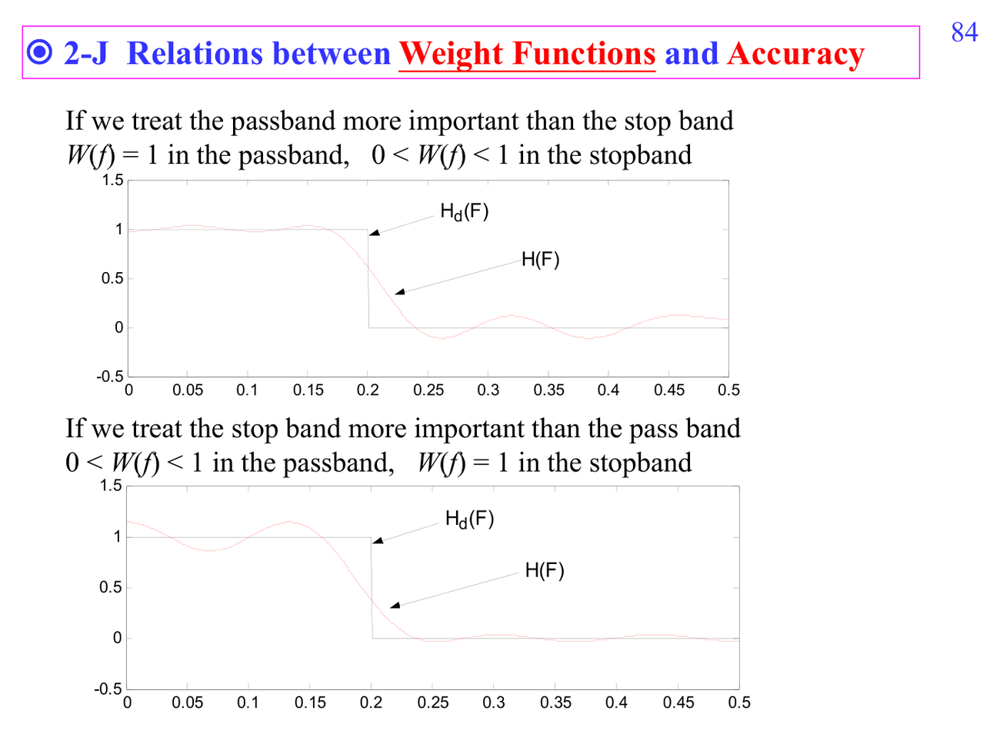
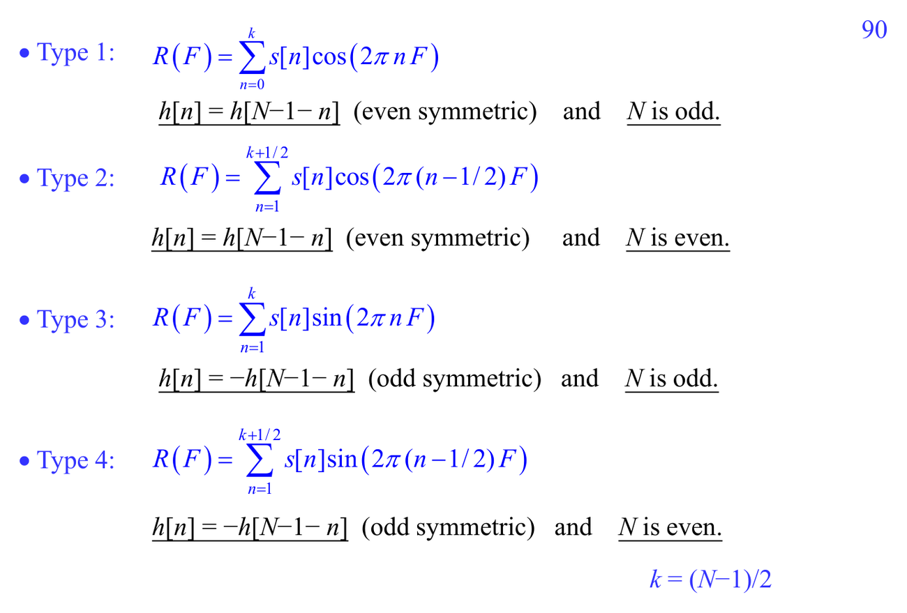
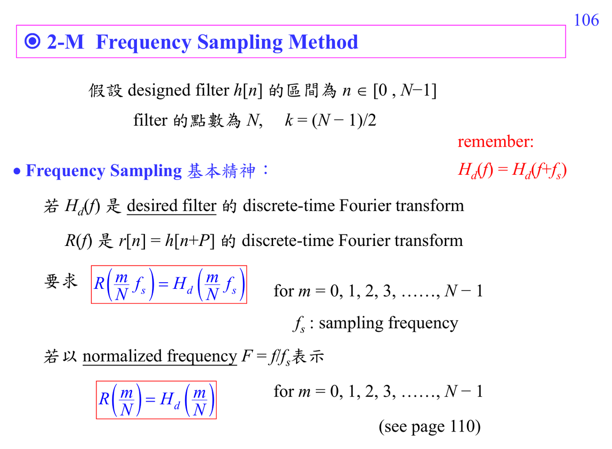

# ADSP Write2 FIR design details

Write2 接著 Write1 的 [[FIR filter|FIR]] design，從「知道方法」進到「知道規格如何影響設計」。

主線可以這樣走：

1. [[Filter transition band]]：transition band 越窄，通常 filter length 越長。
2. [[Weighted approximation error]]：passband/stopband 權重改變後，ripple 會重新分配。
3. [[Four FIR filter symmetry types]]：linear-phase FIR 依 length 奇偶和對稱/反對稱分成四類；每一類在 $\omega=0$ 或 $\pi$ 的限制不同，不能亂套。
4. [[Frequency sampling FIR design]]：直接指定若干 frequency samples，再用 inverse DFT 得到 impulse response；直觀但 ripple/transition 控制較粗。

這份講義應該連回 [[Linear phase FIR filter]]、[[Least MSE FIR design]]、[[Minimax FIR design]]。如果只背 type I/II/III/IV 會很快忘；比較好的讀法是問：「這個 symmetry 強迫 frequency response 長什麼樣？它適合 low-pass、high-pass、Hilbert transformer，還是 differentiator？」

前置補洞：[[Optimization for filter design]]、[[Frequency response]]、[[Discrete Fourier transform]]。

## 講義截圖

