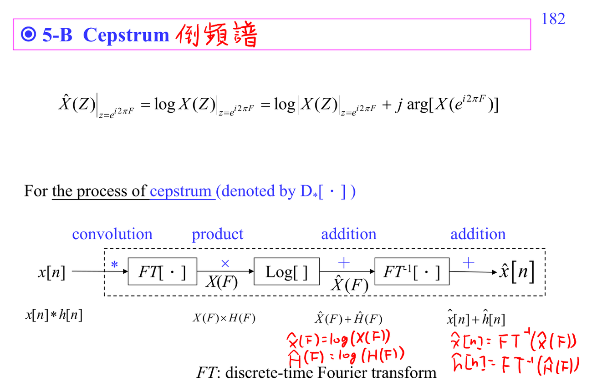

# ADSP Write3 filters and homomorphic processing

Write3 分成兩段：先介紹常用 filters，再進入 homomorphic/cepstrum。

前半段的 filter 應該按任務讀：

- [[Notch filter]]：移除窄頻干擾。
- [[Smoother filter]]：用 local averaging 壓高頻雜訊，但會模糊快速變化。
- [[Hilbert transform filter]]：做 $90^\circ$ phase shift，常用於 analytic signal。
- [[Edge detection filter]]：差分/高通，強調影像或訊號中的 abrupt change。
- [[Matched filter]]：已知 template 時最大化 detection SNR。
- [[Wiener filter]]：已知 signal/noise statistics 時最小化 MSE。
- [[Equalizer filter]]：補償 channel distortion。

後半段是另一個思路：[[Homomorphic signal processing]] 把 convolution 透過 Fourier 和 log 轉成 addition；[[Cepstrum]]、[[Complex cepstrum]]、[[Differential cepstrum]]、[[Mel-frequency cepstrum]] 都是這條線的變形。讀這裡時要特別分清 spectrum 的 frequency axis 和 cepstrum 的 quefrency axis。

前置補洞：[[Probability for random signals]]、[[Cepstrum prerequisite map]]、[[Frequency response]]。

## 講義截圖

