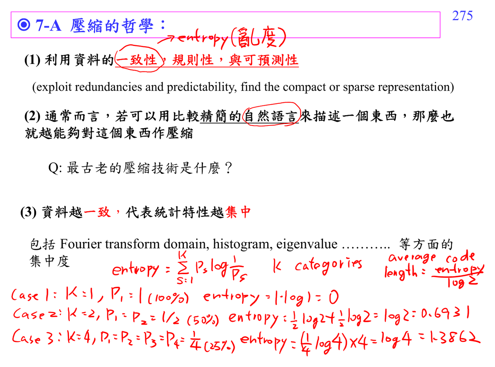
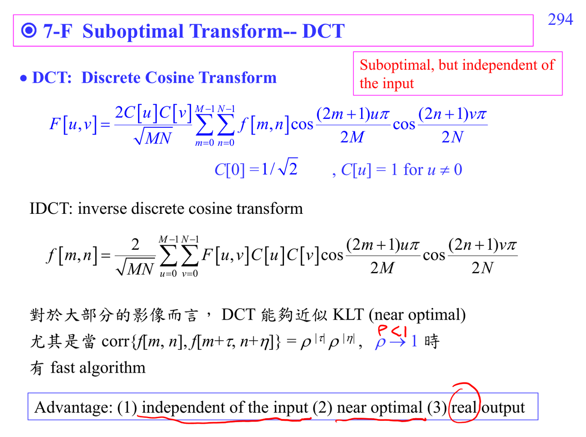
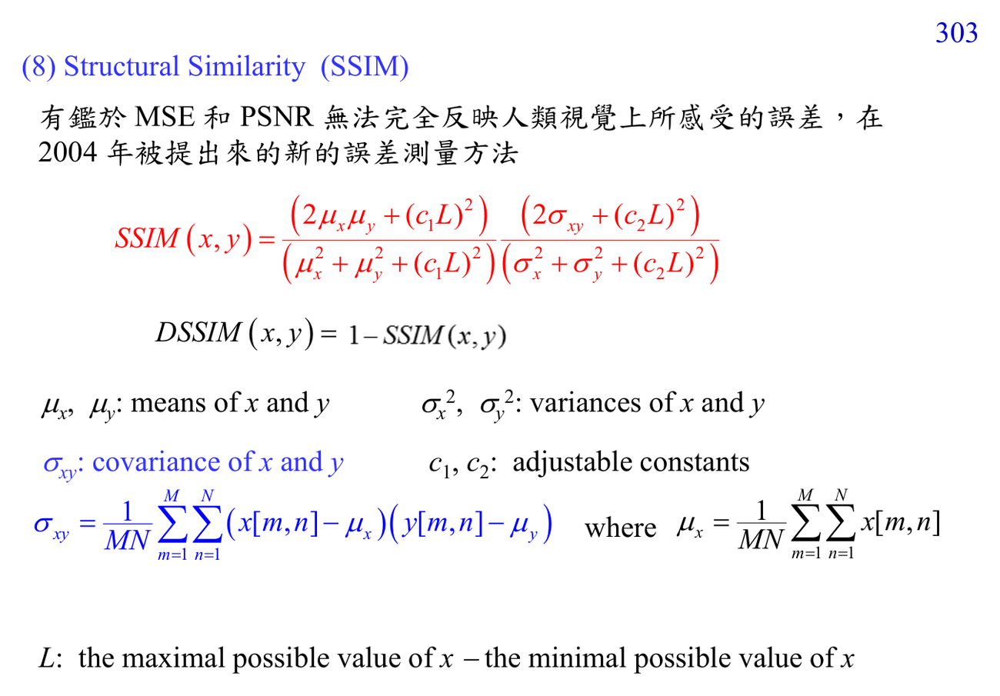
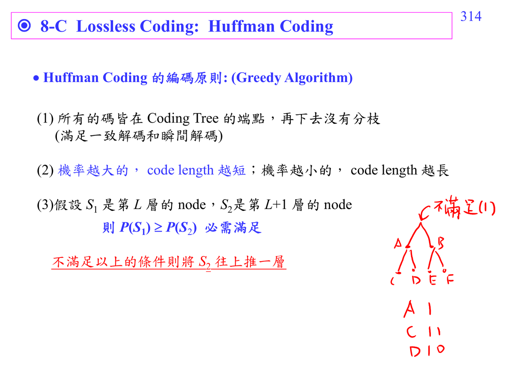

# ADSP Write5 data compression

Write5 以 data compression 為主，先講 redundancy/consistency，再進入 JPEG、DCT、KLT、SSIM、quantization、zigzag scan、Huffman coding 與 entropy。這份講義同時把 signal processing 的 transform intuition 與 information theory 接起來。

## 講義截圖

