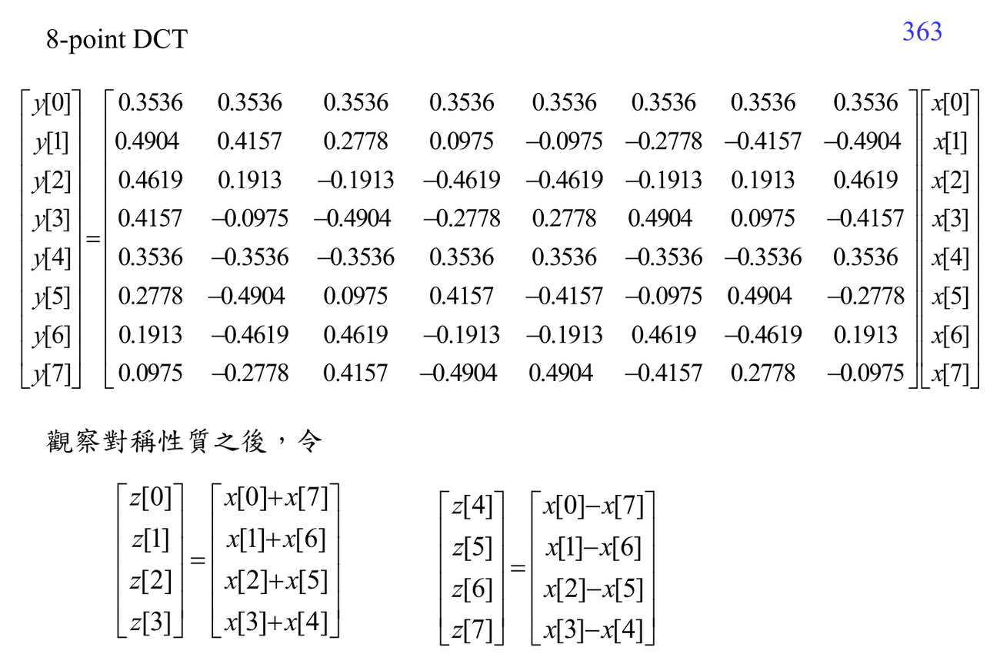

# ADSP Write6 fast algorithms

Write6 的主題不是新的 transform，而是問：同一個 [[Discrete Fourier transform]] 或 [[Discrete cosine transform]]，能不能用更少乘法、加法與記憶體搬移算出來？

這份講義的路線可以這樣讀：

1. 先用 [[Fast algorithm design]] 建立觀念：fast algorithm 依靠 symmetry、periodicity、sparsity、separability，不是改變數學答案。
2. 再看 [[Complexity of DFT and convolution]]：直接 DFT 是 $O(N^2)$，如果每次都照定義算，長訊號和影像 block 會太慢。
3. 把 transform 寫成矩陣後，接 [[Matrix multiplication complexity]]：fast DFT/DCT 本質上是把 dense transform matrix 分解成 sparse factors、permutation、diagonal twiddle matrices。
4. 進入 FFT 結構：[[Butterfly computation]] 是最小局部運算，[[Twiddle factor]] 是子問題之間的 phase correction，[[Cooley-Tukey FFT]] 是主要分解框架。
5. 最後比較不同分解：[[Radix-4 FFT]] 用 4-way decomposition 減少 stage；[[Prime factor FFT]] 在長度互質時用 index mapping 減少 twiddle 成本。

讀圖時不要先盯著線路圖背。先標出 input order、output order、stage number、每個 stage 的 small DFT，以及哪裡只是 permutation。講義中的 fast DCT 圖也可以用同一種眼光看：它把 DCT matrix 拆成比較便宜的加減、旋轉和重排。

這章往前連到 [[Discrete Fourier transform]]、[[Discrete cosine transform]]、[[Twiddle factor]]；往後連到實作時的 [[Python and MATLAB for signal processing]]。如果你在 index decomposition 卡住，先讀 [[Fast algorithm prerequisite map]]，再回來看 Cooley-Tukey 的 $N=N_1N_2$ 分解。

## 講義截圖

