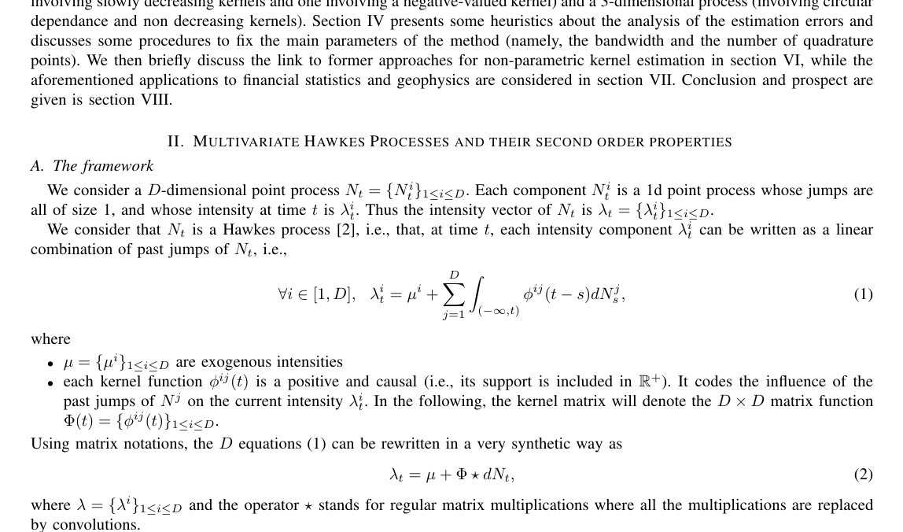
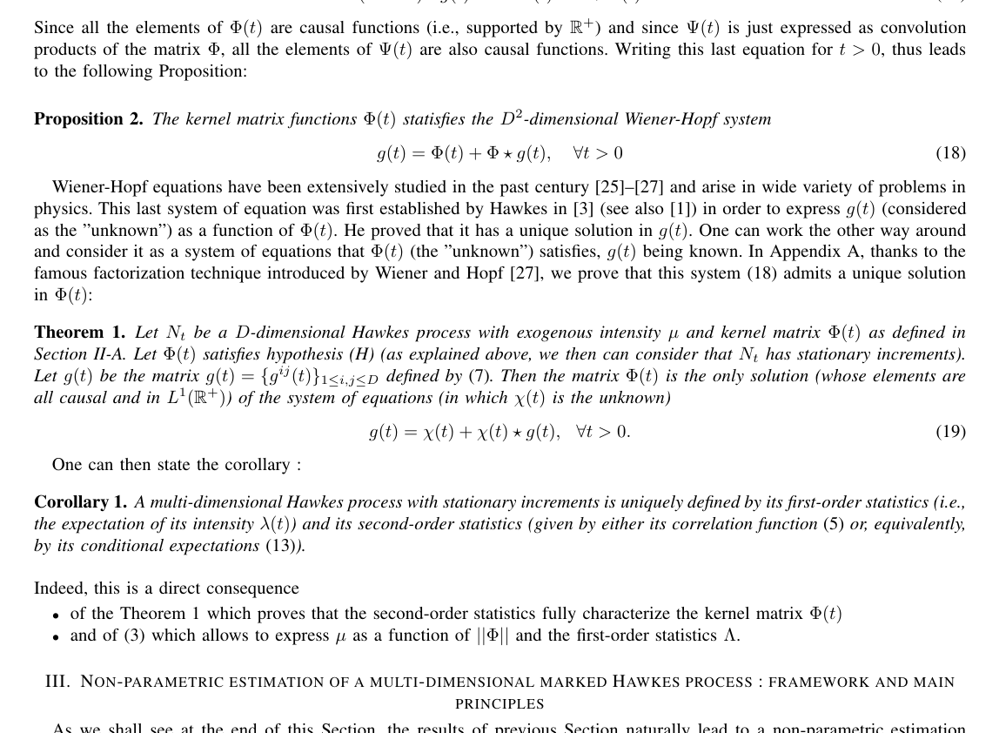

# Bacry Muzy 2015 Hawkes second-order statistics

這篇提供 Hawkes 報告的 theoretical backbone。它說明 multivariate Hawkes process 的 second-order statistics 能 characterize kernel matrix，並形成 nonparametric estimation 的基礎。

## Key Equation

對 multivariate Hawkes，

$$
\lambda_i(t)=\mu_i+\sum_j\int_0^t \phi_{ij}(t-s)dN_j(s).
$$

kernel $\phi_{ij}$ 描述 type $j$ event 對 type $i$ future intensity 的影響。若允許 non-positive kernels，也能描述 inhibition。

## Main Contribution

作者把 jumps correlation / covariance 與 kernel matrix 連成 Wiener-Hopf integral equations。這代表可以從 empirical second-order statistics 反推出 $\phi_{ij}(t)$，而不必先假設 kernel 是 exponential。

## How To Use In The Report

把這篇放在 methodology background：它提供「如何從資料估 Hawkes kernels」的理論理由。後面的 LOB papers 才能討論 calibrated kernels 是否有 market microstructure interpretation。

## Limitation

Nonparametric estimation 需要選 discretization、support length、regularization/estimation parameters。報告中不要只說它 flexible，也要說它會把問題轉成 inverse problem。

## Figures For Report

