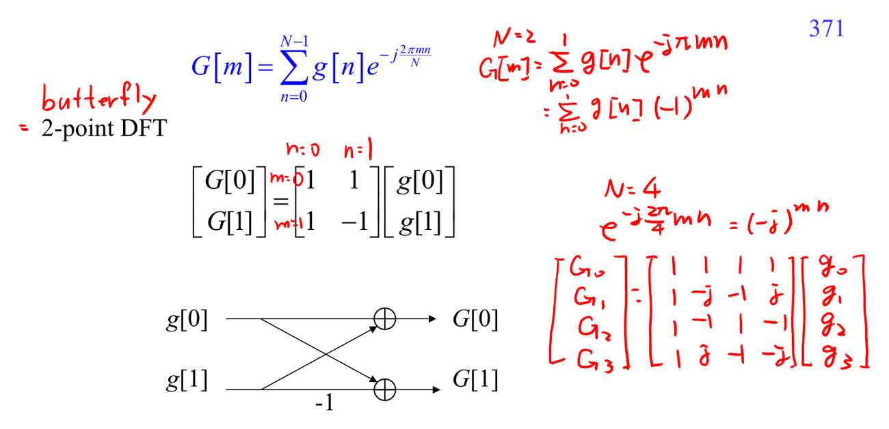

# Butterfly computation

Butterfly 是 [[Fast Fourier transform|FFT]] 的基本局部運算。最簡單的 2-point DFT 是

$$
X[0]=x[0]+x[1],\qquad X[1]=x[0]-x[1].
$$

這就是 butterfly 的雛形：同一對 input 產生 sum 和 difference。更大的 FFT 會在不同 stage 加入 [[Twiddle factor]]，但核心仍是「重用一組加減結果」。

讀 butterfly 圖時請標出：

- 左邊是哪兩個 input 或 partial results。
- 右邊是哪兩個 output 或 partial results。
- 哪條線乘上 twiddle factor。
- 這個 butterfly 屬於第幾個 stage。

它連到 [[Cooley-Tukey FFT]]，因為 Cooley-Tukey 就是把大 [[Discrete Fourier transform|DFT]] 拆成很多 butterfly-like local computations。

## 講義截圖

