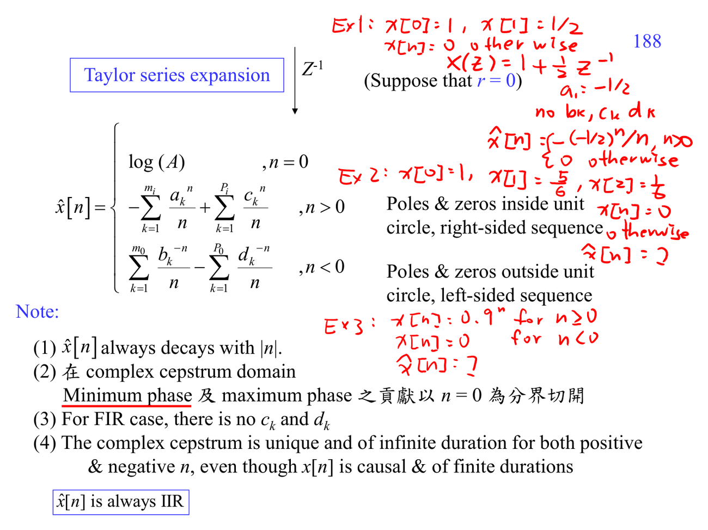

# Complex cepstrum

Complex cepstrum 保留 phase information，因此比只看 $\log |X(F)|$ 更完整，但需要處理 phase ambiguity。從 Z-transform 的 poles/zeros 可以推導 complex cepstrum；minimum phase 與 maximum phase 會讓 cepstrum 支撐在不同方向。

它需要 [[Z-transform]]、[[Unit circle and Z-transform]] 與 [[Complex numbers for DSP]]。

## 講義截圖

