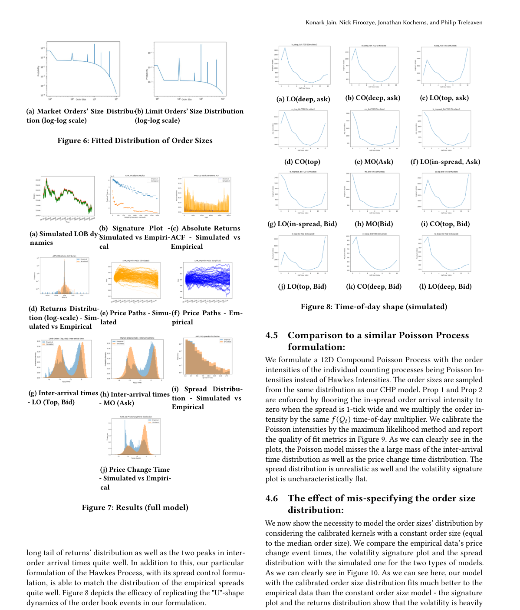

# Compound Hawkes process for LOB order size modeling

這篇把 LOB simulator 從「只有 event times/types」推進到「event 帶有 order size」。它適合放在 report 的 applied modeling section。

## Model Interpretation

LOB event stream 可以包含多種 event types，例如 limit order、market order、cancel order，以及 bid/ask side。Compound Hawkes 的想法是：事件由 Hawkes intensity 產生，但每個 event 還附帶 size mark，因此 simulation 能推動 order book state。

## Contributions For Report

- 用 nonparametric kernels 捕捉 event types 之間的 excitation/inhibition。
- 讓 model parameters condition on time of day，反映 intraday seasonality。
- 校準 order size distributions，避免把所有 order size 當常數。
- 用 simulator 檢查 stylized facts：inter-arrival time、spread、returns、market impact。

## Important Figure Reading

calibrated kernels 圖可用來討論 cross-excitation：某一種 order event 是否會提升另一種 event 的 arrival rate。market impact 圖則可支撐 simulator 是否有經濟合理性。

## Limitation

即使加入 size，mark distribution 仍可能不夠 history-dependent。這正好引到 [[Neural marked Hawkes process for LOB]]。

## Figures For Report

