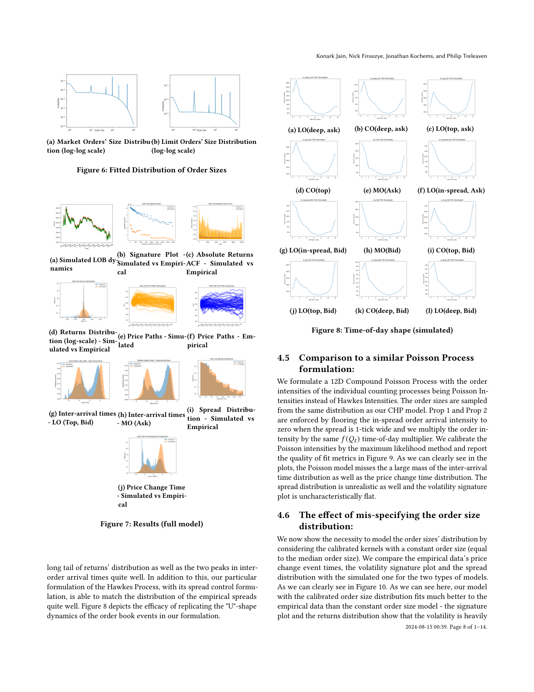
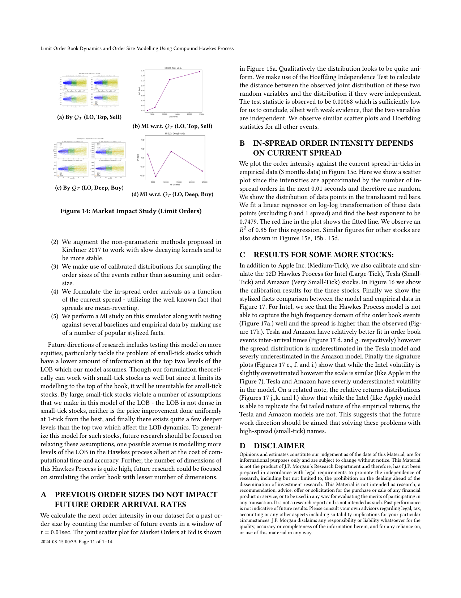

# Compound Hawkes process for LOB order size modeling

這篇把 Hawkes process 用於 [[Limit order book events]]，並進一步加入 order size。一般 Hawkes LOB 模型常只處理 event timing/type，這篇用 compound Hawkes process 讓每個 event 帶有 sampled order size。

可放進報告的貢獻：

- 模型不只生成 event time/type，也生成 order size。
- calibrates non-parametric kernels，允許 inhibitory cross-excitation。
- parameters condition on time of day，對應市場 intraday seasonality。
- 模擬器可重現部分 LOB stylized facts，例如 returns distribution、inter-arrival time、spread distribution、market impact concavity。

報告討論：

- 優點：比只建模 inter-event time 更接近真實 LOB simulator。
- 限制：order size distribution 和 state dependence 的建模仍可能不夠彈性，這可接到 [[Neural marked Hawkes process for LOB]]。

## 論文圖表截圖

