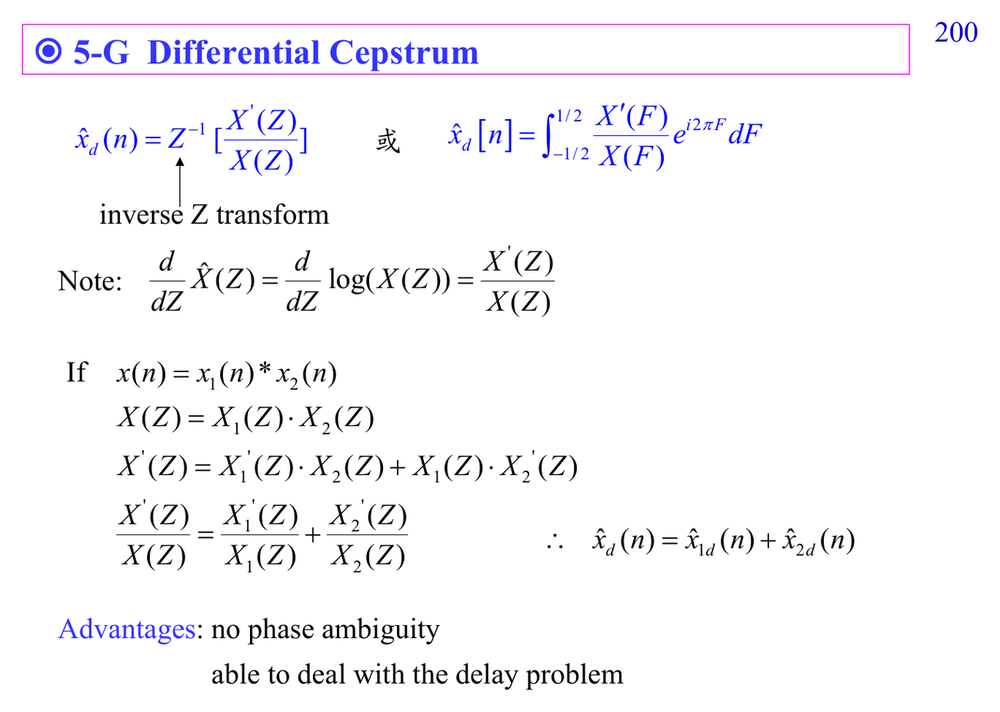

# Differential cepstrum

Differential cepstrum 用 derivative 減少 phase wrapping 的困難。它不是換掉 cepstrum，而是為了穩定處理 phase ambiguity 的變形。

連結：[[Cepstrum prerequisite map]]、[[Homomorphic signal processing]]。

## 講義截圖

