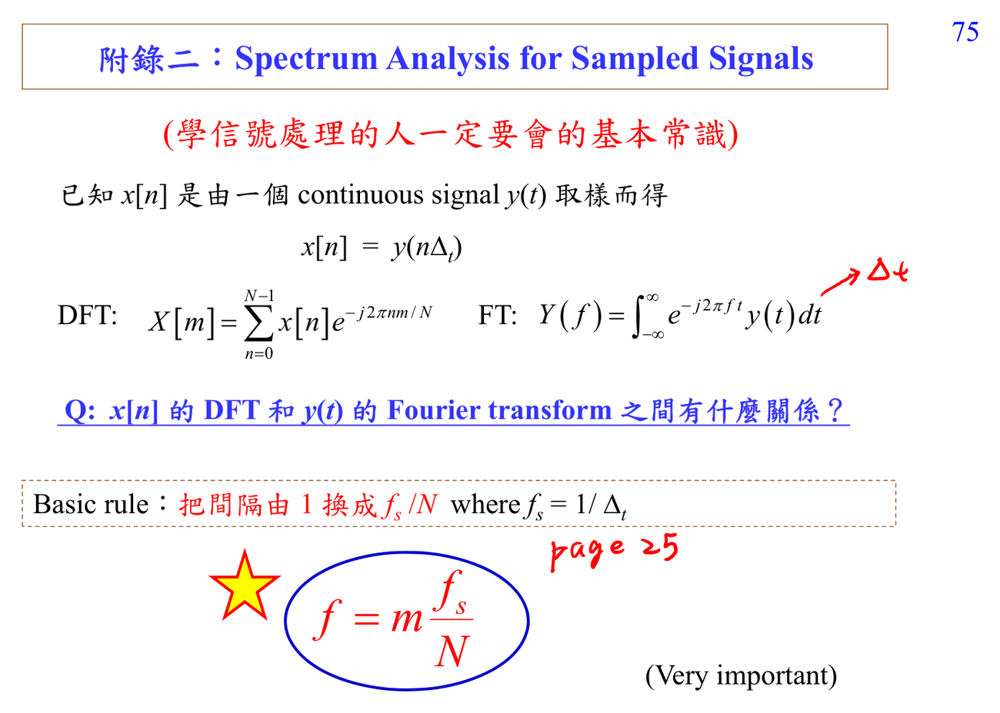

# Discrete Fourier transform

DFT 是把有限長資料投影到 $N$ 個 complex sinusoid basis。它可以被看成 DTFT 的 frequency samples，也可以被看成 circular convolution algebra 的座標系。

連結：[[ADSP notation survival guide]]、[[Spectral analysis workflow]]。

## 講義截圖

