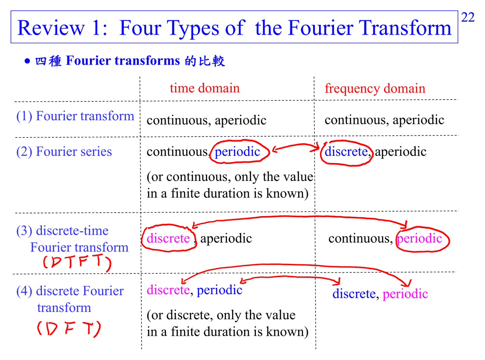
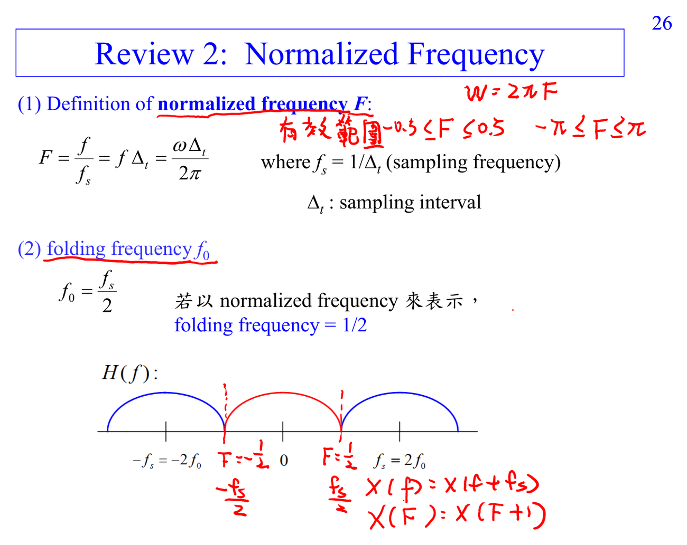

# Discrete-time Fourier transform

DTFT 對 discrete-time、aperiodic sequence $x[n]$ 定義

$$X(F)=\sum_{n=-\infty}^{\infty}x[n]e^{-j2\pi Fn},\qquad x[n]=\int_{-1/2}^{1/2}X(F)e^{j2\pi Fn}\,dF.$$

因為 time 是 discrete，所以 $X(F)$ 對 normalized frequency $F$ 具有週期 1。讀這個公式時要連到 [[Euler formula]] 與 [[Normalized frequency]]。

## 講義截圖

