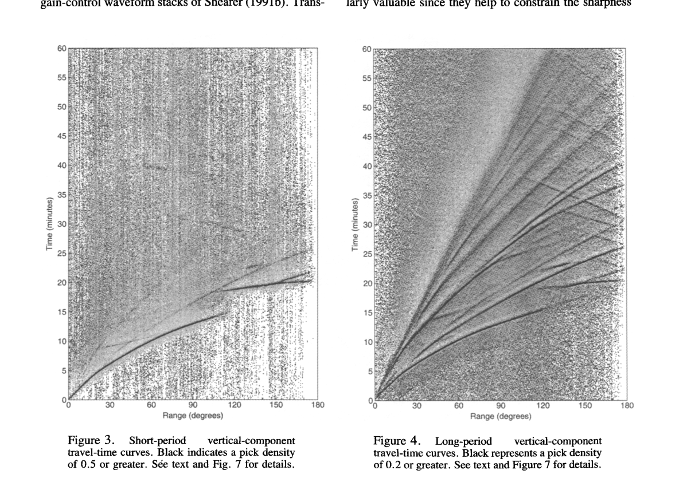

# Earle and Shearer 1994 automatic seismic phase picking

這篇可作為 seismic project 的 baseline paper。它的價值不是「用了 STA/LTA」這麼簡單，而是展示自動化 picking pipeline 如何把 global seismograms 轉成可大規模使用的 arrival picks。

## Method In Words

1. 將 waveform 轉為 envelope/characteristic function，降低 polarity 與細節震盪的影響。
2. 用 [[STA LTA picker]] 找 local energy 相對 background 的突增。
3. 用 trigger rule 產生 candidate arrivals，再用 travel-time curve 與 quality control 排除不合理 picks。

這張圖放在方法小節，解釋 detector statistic 如何從 waveform 產生。你要在圖旁寫：threshold crossing 是 decision rule，不是 arrival 的物理定義；因此 threshold choice 會影響 false alarm 與 missed detection trade-off。

這張圖放在 validation/quality-control 小節。它說明 automatic picks 不能只看 local waveform，也要和 physically plausible travel-time structure 對齊。

