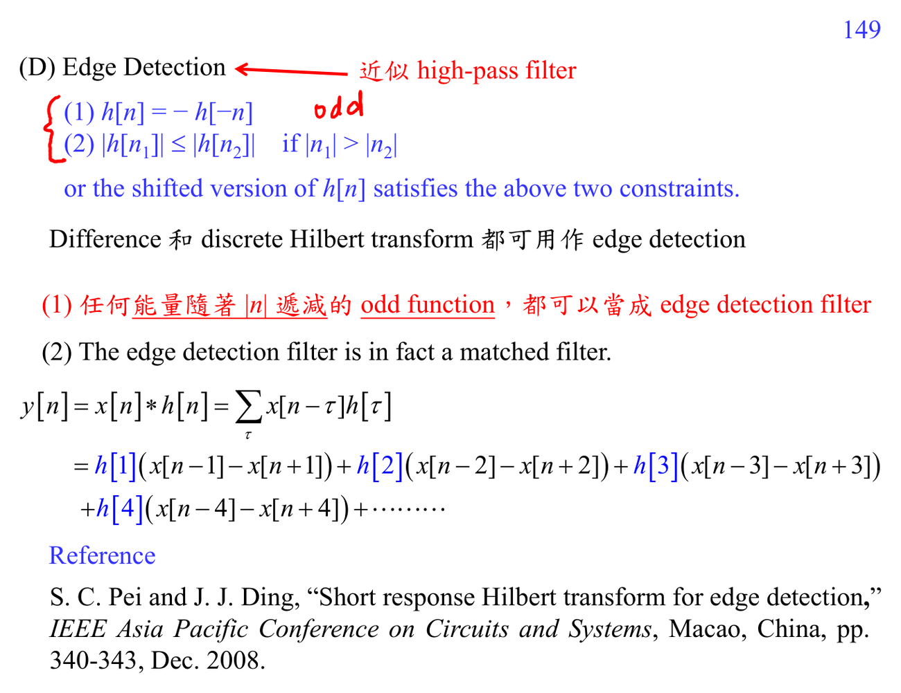

# Edge detection filter

Edge detection filter 近似 highpass 或 differentiation。1-D difference $x[n+1]-x[n]$ 對 step edge 很敏感；2-D image 中可用 Sobel operator 偵測水平、垂直、斜向 edge。

直覺：edge 是 intensity 突變，所以在 frequency domain 有較多 high-frequency energy。

## 講義截圖

