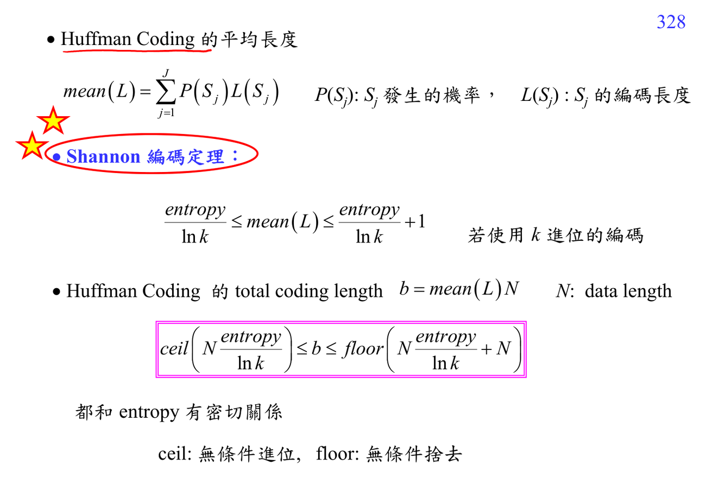

# Entropy coding length

Entropy 衡量 symbol distribution 的不確定度：

$$H=\sum_s P(s)\ln\frac{1}{P(s)}.$$

若用 $k$ 進位碼，平均碼長滿足

$$\frac{H}{\ln k}\le mean(L)<\frac{H}{\ln k}+1.$$

總資料長度 $N$ 時，entropy 給出 total bit length 的 lower bound。

## 講義截圖

