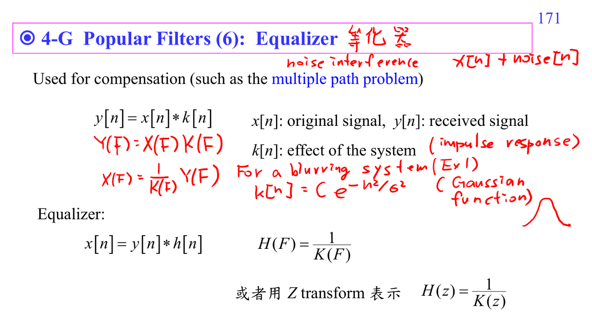

# Equalizer filter

Equalizer 用來補償 channel/system effect。若 $y[n]=x[n]*k[n]$，frequency domain 中 $Y(F)=X(F)K(F)$，理想 equalizer 是

$$H(F)=\frac{1}{K(F)}.$$

但當 $K(F)$ 很接近 0 時，noise 會被放大，所以實務上會結合 [[Wiener filter]] 或 regularization。

## 講義截圖

