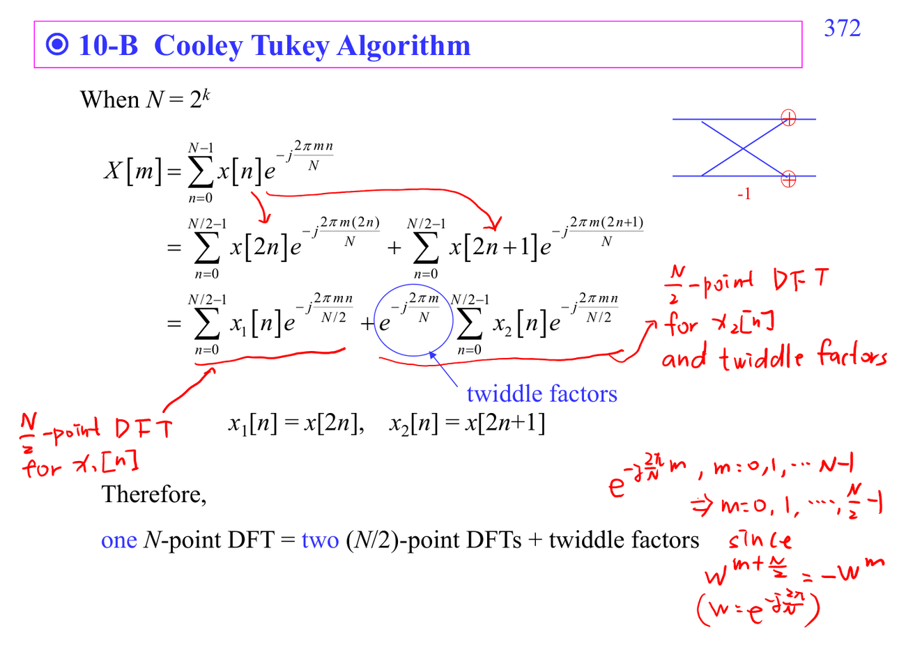
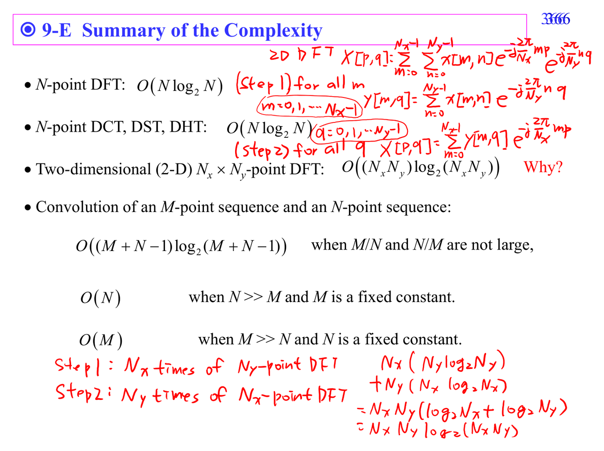

# Fast Fourier transform

FFT 是一族演算法，不是一個公式。Cooley-Tukey 把 DFT 拆成 smaller DFTs；radix-2/radix-4/prime-factor 是不同拆法。

## 深入解說

Fast algorithms 的目的不是改變數學結果，而是用 factorization、symmetry、reuse intermediate results 讓同一個轉換用更少運算完成。直接 DFT 是 $O(N^2)$，FFT 透過把 $N$ 點問題拆成 smaller DFTs，降到 $O(N\log N)$。講義裡的 butterfly、twiddle factor、radix-4、prime factor FFT 都是在回答同一件事：矩陣乘法裡哪些乘加可以共用、哪些係數其實重複、哪些 permutation 只是重新排 index。讀 fast algorithm 圖時不要被 wiring 嚇到，先標出 input order、output order、stage、以及每個 stage 做的 small DFT。

## 對你目前程度的讀法

先把這篇放回 [[Fast algorithm prerequisite map]]。如果公式看起來突然跳太快，先不要急著背結論；把每個 symbol 的 role 寫在旁邊：它是 sample index、frequency variable、filter coefficient、random variable，還是 matrix/vector component。ADSP 很多困難其實不是微積分技巧，而是 notation 在 time domain、frequency domain、Z-domain、matrix domain 之間切換。

## 公式和講義圖怎麼讀

DFT kernel $W_N^{kn}$ 有週期性與對稱性；FFT 把 $n,k$ 拆成多個 indices 後重排 summation。你可以把每張 butterfly 圖翻譯回 matrix factorization：permutation matrix、small DFT block、diagonal twiddle matrix、再加下一層 block。

## 常見卡點

- 把 DFT bin 當成連續頻率，會誤讀頻譜解析度與 aliasing。
- 只看 magnitude 不看 phase，會漏掉 delay、linear phase、minimum phase、cepstrum inverse 等問題。
- 把 optimal 當成絕對最好；其實 optimal 永遠相對於 chosen model、norm、constraint。
- 忘記 implementation cost；ADSP 後半的 fast algorithms 會一直追問同一個數學結果能不能更有效率地算。

## 自我檢查

能不能數出 direct method 和 fast method 的乘加次數級別？能不能把 butterfly 圖轉成加減和 twiddle multiplication？

## 相關筆記

- [[Advanced digital signal processing]]
- [[ADSP math prerequisites MOC]]
- [[Fast algorithm prerequisite map]]

## 講義截圖

