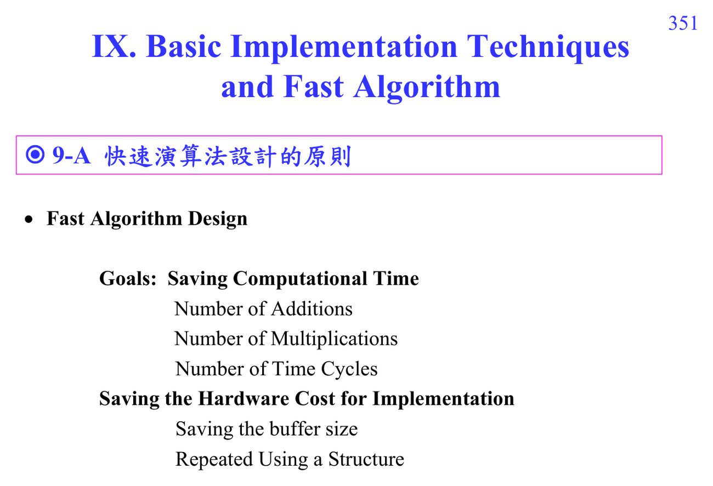

# Fast algorithm design

Fast algorithm design 的目標是省 computational time 與 hardware cost：減少 additions、multiplications、time cycles、buffer size，並重複使用 structure。

Write6 的核心觀念是把大矩陣/大 DFT 拆成較小問題，再利用 symmetry 與 special constants。

## 講義截圖

