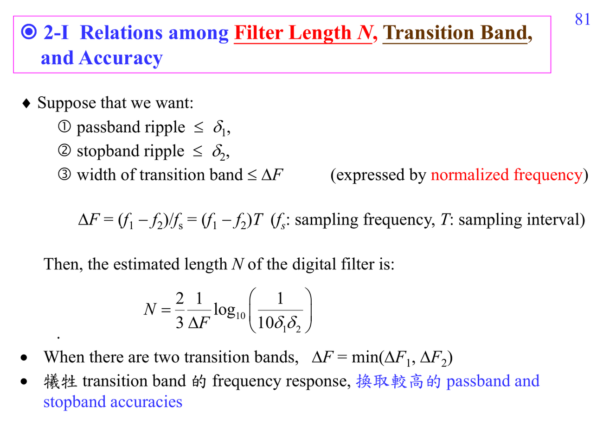

# Filter transition band

Transition band 是 passband 和 stopband 之間不可避免的緩衝區。transition 越窄、ripple 越小，通常需要越長的 FIR 或更高 order。

## 深入解說

Filter design 的問題可以寫成一句話：我想要一個系統 $H(e^{j\omega})$，讓某些頻率通過、某些頻率被壓掉，而且 phase、ripple、transition band、order 都要可控。這比微積分裡單純解方程更像 constrained approximation：你先指定 desired response $D(\omega)$，再選 FIR/IIR 結構，最後決定用 least-squares、weighted error、minimax/equiripple 或 bilinear transform。讀講義圖時要分清楚四件事：magnitude response、phase response、error function、以及設計變數 $h[n]$ 或 poles/zeros。很多公式看起來像線代，其實是在做「把理想曲線投影到有限長 filter 能表示的子空間」。

## 對你目前程度的讀法

先把這篇放回 [[Optimization for filter design]] 和 [[Spectral analysis workflow]]。如果公式看起來突然跳太快，先不要急著背結論；把每個 symbol 的 role 寫在旁邊：它是 sample index、frequency variable、filter coefficient、random variable，還是 matrix/vector component。ADSP 很多困難其實不是微積分技巧，而是 notation 在 time domain、frequency domain、Z-domain、matrix domain 之間切換。

## 公式和講義圖怎麼讀

把設計式寫成 $E(\omega)=W(\omega)(D(\omega)-H(e^{j\omega}))$ 會清楚很多：$D$ 是你想要的理想曲線，$H$ 是目前 filter 做得到的曲線，$W$ 決定哪裡比較重要。Least MSE 看 $\int |E(\omega)|^2d\omega$，minimax 看 $\max_\omega |E(\omega)|$。

## 常見卡點

- 把 DFT bin 當成連續頻率，會誤讀頻譜解析度與 aliasing。
- 只看 magnitude 不看 phase，會漏掉 delay、linear phase、minimum phase、cepstrum inverse 等問題。
- 把 optimal 當成絕對最好；其實 optimal 永遠相對於 chosen model、norm、constraint。
- 忘記 implementation cost；ADSP 後半的 fast algorithms 會一直追問同一個數學結果能不能更有效率地算。

## 自我檢查

能不能指出 passband、stopband、transition band 和 ripple？能不能說出這個設計在最小化哪一種 norm？能不能預測 filter length 變長會改善哪個規格？

## 相關筆記

- [[Advanced digital signal processing]]
- [[ADSP math prerequisites MOC]]
- [[Optimization for filter design]] 和 [[Spectral analysis workflow]]

## 講義截圖

