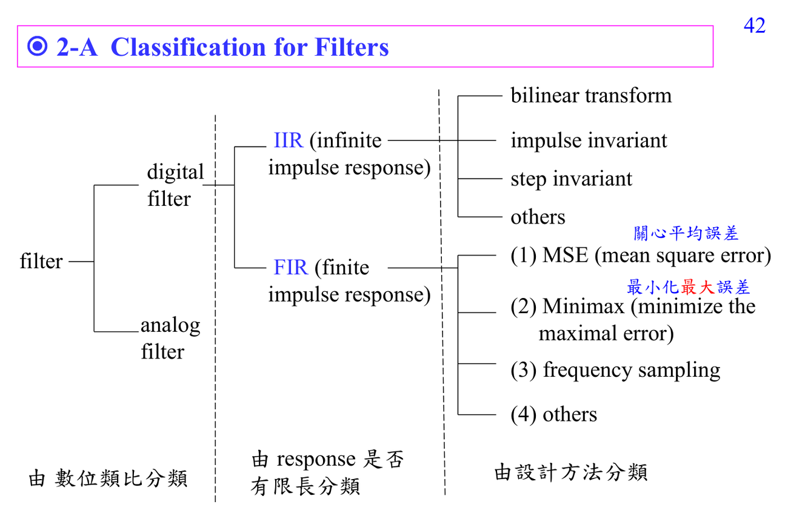

# Frequency response

Frequency response 是 LTI system 對每個 complex exponential 的 gain 和 phase：輸入 $e^{j\omega n}$，輸出只差一個倍數 $H(e^{j\omega})$。這是 filter design 的共同語言。

## 深入解說

這一群筆記的核心是把 signal 換成「basis 的係數」來看。你修過微積分，所以可以把連續 Fourier transform 想成把函數投影到 $e^{j\omega t}$；在 DSP 裡我們大多處理 sequence $x[n]$，所以 notation 會變成 $e^{j\omega n}$、$z^{-1}$、或 DFT 的 $W_N^{kn}$。最重要的觀念不是背公式，而是知道每個 transform 的 domain：time index 是 $n$，frequency 是 normalized angular frequency $\omega$，DFT bin 是 $k$。當講義畫頻譜、unit circle、或 sampled spectrum 時，先問三件事：現在的變數是 $\omega$ 還是 $k$？頻率是否以 $2\pi$ 為週期？目前看到的是 true DTFT 還是只取樣後的 DFT？

## 對你目前程度的讀法

先把這篇放回 [[ADSP notation survival guide]] 和 [[Spectral analysis workflow]]。如果公式看起來突然跳太快，先不要急著背結論；把每個 symbol 的 role 寫在旁邊：它是 sample index、frequency variable、filter coefficient、random variable，還是 matrix/vector component。ADSP 很多困難其實不是微積分技巧，而是 notation 在 time domain、frequency domain、Z-domain、matrix domain 之間切換。

## 公式和講義圖怎麼讀

常見公式要這樣讀：$X(e^{j\omega})=\sum_n x[n]e^{-j\omega n}$ 是把每個 time sample 對不同 rotating basis 加權；$X[k]=\sum_{n=0}^{N-1}x[n]W_N^{kn}$ 是只取 $N$ 個 frequency samples。若看到 shift property，先判斷 shift 發生在 time 還是 frequency；若看到 convolution property，立刻連到 [[Convolution]] 和 [[Frequency response]]。

## 常見卡點

- 把 DFT bin 當成連續頻率，會誤讀頻譜解析度與 aliasing。
- 只看 magnitude 不看 phase，會漏掉 delay、linear phase、minimum phase、cepstrum inverse 等問題。
- 把 optimal 當成絕對最好；其實 optimal 永遠相對於 chosen model、norm、constraint。
- 忘記 implementation cost；ADSP 後半的 fast algorithms 會一直追問同一個數學結果能不能更有效率地算。

## 自我檢查

能不能說出這篇裡每個頻率變數的單位？能不能解釋為什麼 discrete-time 頻譜會週期化？能不能把 DFT bin 換算成 Hz 或 normalized frequency？

## 相關筆記

- [[Advanced digital signal processing]]
- [[ADSP math prerequisites MOC]]
- [[ADSP notation survival guide]] 和 [[Spectral analysis workflow]]

## 講義截圖

