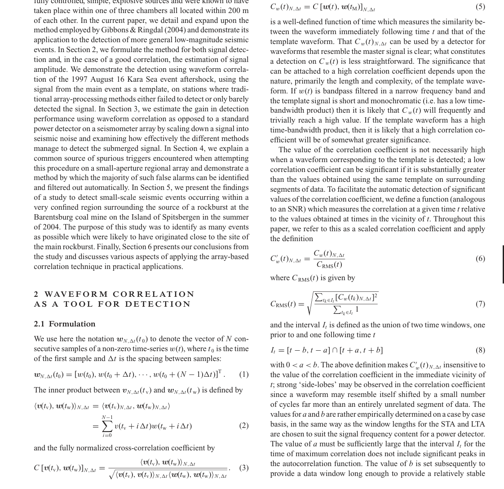

# Gibbons Ringdal 2006 array waveform correlation

這篇代表 template-based seismic detection。它的問題設定和 STA/LTA 不同：不是偵測任何 sudden energy，而是在 continuous data stream 中找「和已知 event waveform 相似」的弱事件。

## Method

單站 detector 是 normalized running cross-correlation：

$$
C_m[\ell]=
\frac{\langle s_m, x_m[\ell:\ell+L]\rangle}
{\|s_m\|\,\|x_m[\ell:\ell+L]\|}.
$$

如果兩個 events co-located，correlation peaks 的 relative timing 在 array stations 上會 coherent。把多個 channels 的 correlation traces 對齊並 stack，就能取得 array gain。

## Report-Level Reading

這篇可以連回 [[Matched filter]]：template 是已知 signal shape，cross-correlation 是 matched-filter statistic。它也連到 [[Array beamforming for seismic detection]]，因為 array processing 的重點是 coherent summation。

## Limitation

需要高品質 template；對 unknown source、source mechanism 變化、path effect 變化較脆弱。報告中可把它和 wavelet-AIC 對比：前者是 similarity detector，後者是 general onset/change detector。

## Figures For Report

