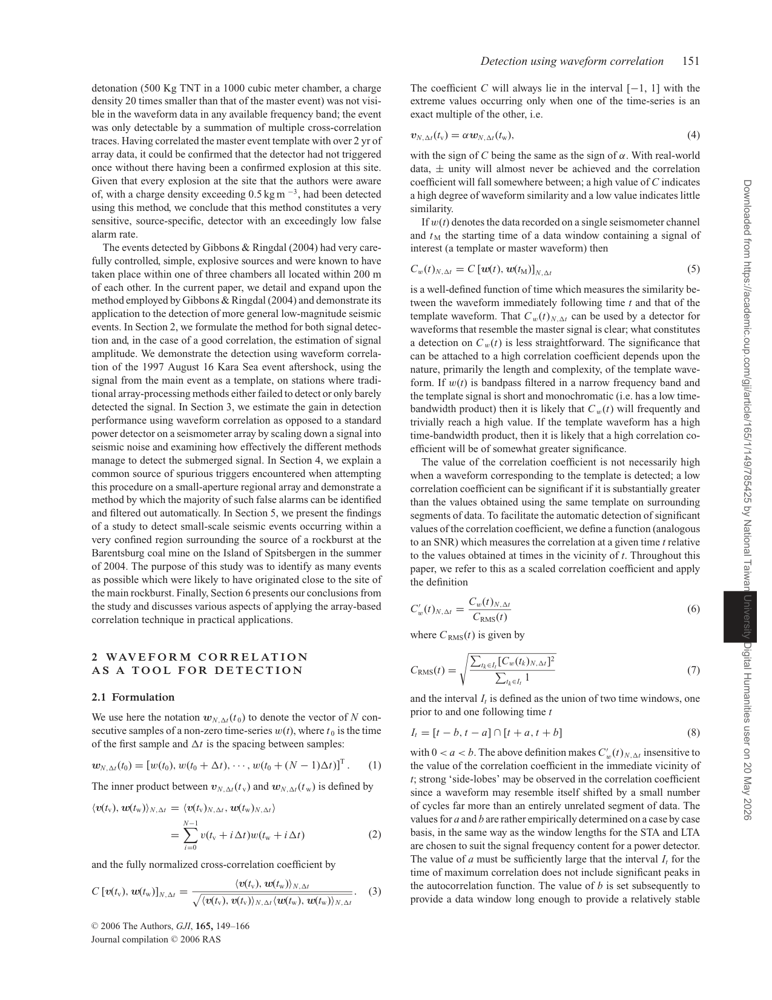

# Gibbons Ringdal 2006 array waveform correlation

這篇適合當地震波專題的 matched-filter / template-based detection 代表。作者用 waveform template 和 incoming data 做 running cross-correlation，並把 correlation traces 在 seismic array 上 stack/beamform，提高低震級事件的 detection power。

核心 idea：

- 若兩個事件 co-located，waveform pattern 會相似；cross-correlation peak 的 lag 可指出重複事件。
- 單站 correlation 已可比 STA/LTA 更敏感；array-based stacking 進一步利用多 sensor coherence。
- 即使原始 waveform 在各 station 上不完全相同，只要 correlation coefficient traces coherent，就能透過 array gain 偵測弱事件。

報告比較：

- 和 [[STA LTA picker]] 相比，correlation detector 對 known/repeating source 很強，但需要 template。
- 和 [[Wavelet transform for seismic picking]] 相比，它不是一般 onset picker，而是 similarity detector。
- 和 [[Matched filter]] 直接相關，可放在 ADSP 方法章。

## 論文圖表截圖

