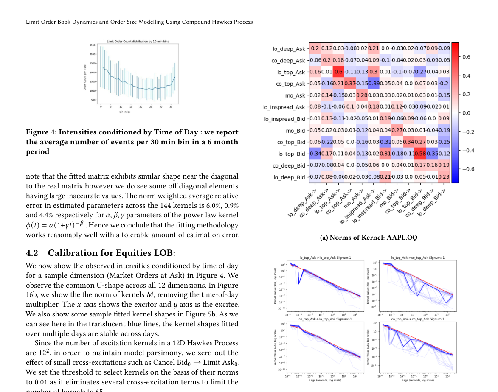
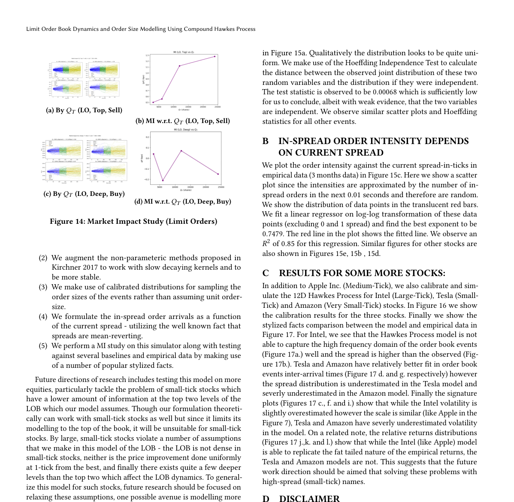

# Hawkes process limit order book project

這個題目適合寫成「event-stream signal modeling」的報告，而不是把 LOB 當一般 time series。主線可以是：

**How can Hawkes-type conditional intensity models describe self-exciting and mutually exciting dynamics in a limit order book?**

核心論點：LOB data 是 asynchronous marked point process。ADSP 的角色是建模 event timing、event type、order size mark 之間的 dependence。傳統 Hawkes 給出可解釋 kernel；compound/marked Hawkes 把 size 加入；neural marked Hawkes 則放寬 mark distribution 與 history dependence 的限制。

## Course Relevance Thesis

Hawkes process 和本課的關聯應寫成 [[Hawkes process as event-domain filtering]]：event stream 是 signal，[[Conditional intensity]] 是 signal representation，[[Hawkes kernel matrix]] 是 event-response kernel，kernel estimation 是 system identification / random signal estimation。

## Report-Ready Argument

1. [[Conditional intensity]] 是 Hawkes model 的中心：$\lambda_i(t)$ 是在 history $\mathcal{H}_t$ 已知時，type $i$ event 下一瞬間發生的 rate。
2. [[Hawkes kernel matrix]] 表示 excitation direction：$\phi_{ij}$ 描述 type $j$ event 如何影響 type $i$ future intensity。
3. [[Hawkes branching ratio]] 與 spectral radius 控制 stability；這是報告中連接數學條件與金融事件群聚的橋。
4. [[Marked Hawkes process]] 與 [[History dependent mark distribution]] 用來處理 order size/volume，不應只把 size 當附屬欄位。
5. [[Neural marked Hawkes process]] 的價值在於讓 mark distribution depends on full history，而不是只靠最近事件或簡單 parametric assumption。

## Unified Notation

- $\mathcal{H}_t=\{(t_n,k_n,v_n):t_n<t\}$：history。
- $t_n$：event time。
- $k_n$：event type，例如 limit order、market order、cancel，以及 bid/ask side。
- $v_n$：mark，例如 order size/volume。
- $N_i(t)$：type $i$ 的 counting process。
- $\lambda_i(t)$：type $i$ 的 [[Conditional intensity]]。
- $\phi_{ij}(u)$：type $j$ event 對 type $i$ intensity 在 lag $u$ 的 kernel。

完整公式集中放在 [[Hawkes project notation]]。

## Figures To Keep

放在 interpretable Hawkes 小節：這張圖的用途是展示 kernel matrix 不是裝飾，而是 market microstructure interpretation。kernel 的方向與 decay shape 可用來討論 buy/sell、limit/market/cancel events 之間的 excitation。

放在 marked/compound Hawkes 小節：這張圖用來支撐 size mark 會改變市場反應。報告文字應說明：time intensity 只描述事件何時出現，compound mark 才讓模型能討論 order size 與 price/impact 的關係。

放在 neural model 小節：這張圖只用來說明 architecture 分工。encoder summarizes event history；intensity head predicts event timing/type；mark head models order size distribution。不要讓圖代替這三個句子的解釋。

## Reading Triage

這份 project note 是報告主線，不是逐段翻譯。被我壓掉或暫時不用的論文內容，集中記在 [[ADSP project paper triage notes#Hawkes Process Limit Order Book Project]]。寫 final report 時若需要補實驗細節、資料設定、或 reviewer-style limitation，再從那篇 triage note 回去找。

## Suggested Sections

1. Abstract：說明 LOB 是 asynchronous marked event stream，本文比較 interpretable Hawkes、compound marked Hawkes、neural marked Hawkes。
2. Introduction：連到 [[Limit order book event stream]]，說明為什麼 regular sampled time-series model 不夠自然。
3. Hawkes process background：使用 [[Hawkes project notation]]、[[Conditional intensity]]、[[Hawkes branching ratio]]。
4. ADSP connection：使用 [[Hawkes report ADSP course alignment]] 與 [[Hawkes process as event-domain filtering]]。
5. Nonparametric and interpretable kernels：主連結 [[Bacry Muzy 2015 Hawkes second-order statistics]]。
6. Compound Hawkes for order size：主連結 [[Compound Hawkes process for LOB order size modeling]]。
7. Neural marked Hawkes：主連結 [[Neural marked Hawkes process for LOB]]。
8. Discussion：使用 [[Hawkes model comparison]] 比較 interpretability、mark modeling、data requirement。
9. Conclusion：回到「from interpretable kernels to flexible history-dependent marks」。

## Links

- [[Hawkes report ADSP course alignment]]
- [[Hawkes process as event-domain filtering]]
- [[Limit order book event stream]]
- [[Conditional intensity]]
- [[Hawkes kernel matrix]]
- [[Hawkes branching ratio]]
- [[Marked Hawkes process]]
- [[Probability for random signals]]
- [[Convolution]]
- [[Wiener filter]]
- [[Conditional expectation]]
- [[Likelihood function]]
