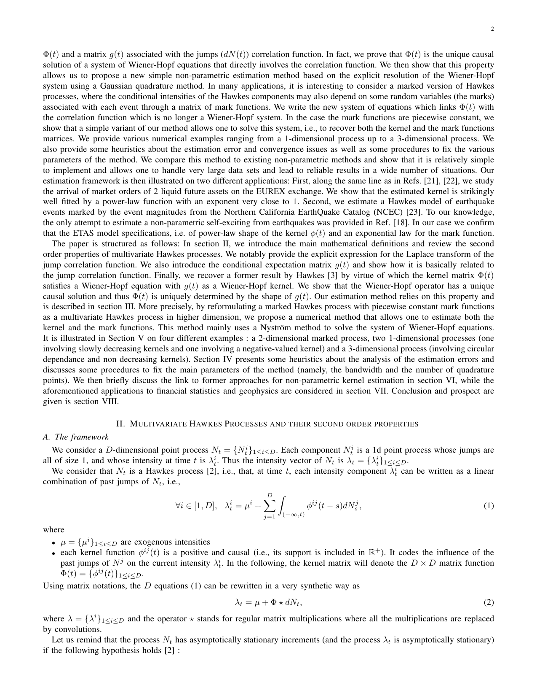
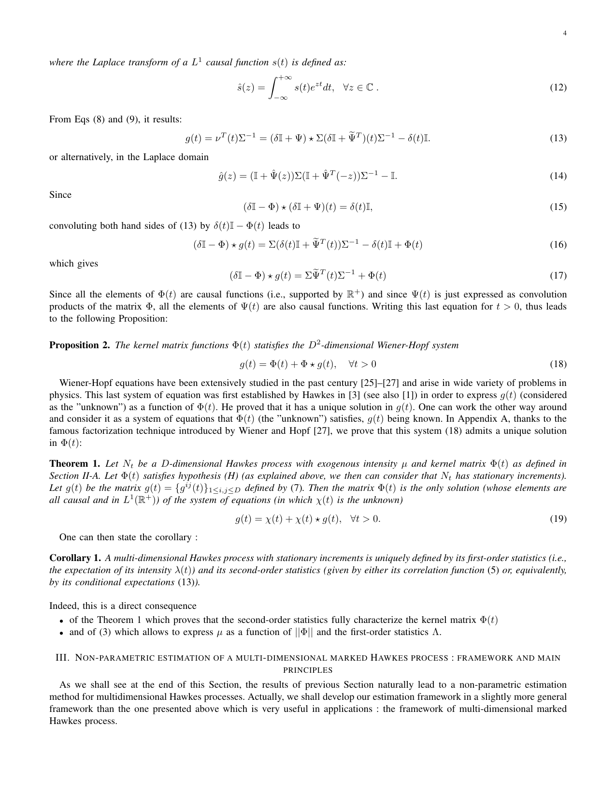
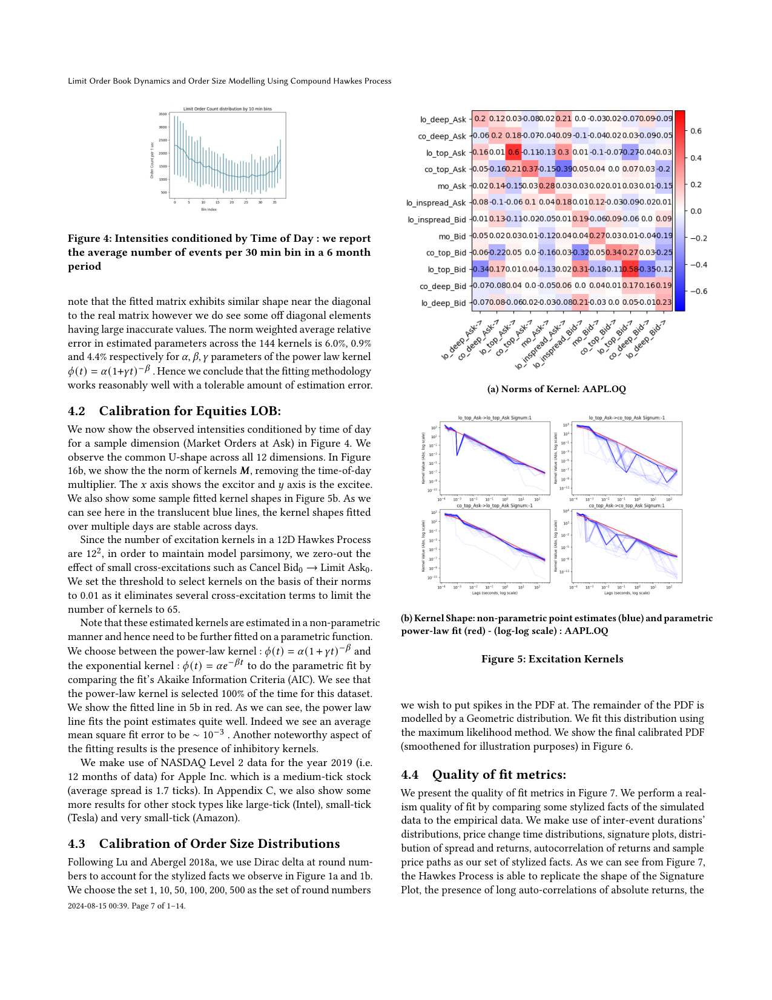
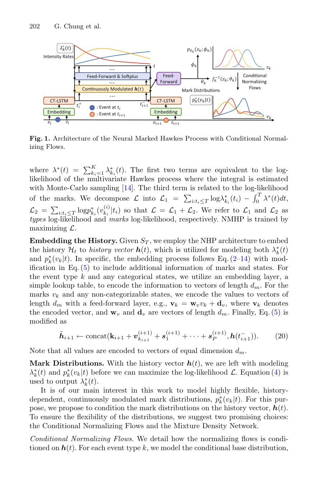

# Hawkes process limit order book project

這條專題可以寫成「Hawkes process models for limit order book event streams」。和地震波不同，這裡觀測到的是離散事件序列：某時間發生某種 order type，可能還帶有 volume/size mark。

報告主線：

1. Event-stream viewpoint：LOB dynamics 可視為 multivariate temporal point process；event type 包含 limit order、market order、cancel order，方向可分 bid/ask。
2. Baseline model：[[Hawkes process]] 用 past events 提升未來 intensity，描述 self-excitation / cross-excitation。
3. Multivariate kernel interpretation：[[Hawkes kernel matrix]] 表示 event type 之間的 excitation 或 inhibition。
4. Estimation：[[Nonparametric Hawkes estimation]] 用 second-order statistics / Wiener-Hopf equations 估 kernel，不必先假設 exponential form。
5. Marks and sizes：[[Marked Hawkes process]] 和 [[Compound Hawkes process]] 把 order size/volume 加進 event model。
6. Neural extension：[[Neural marked Hawkes process]] 用 neural history embedding 和 conditional mark distribution 捕捉 complex, history-dependent volume distributions。
7. Discussion：傳統 Hawkes 可解釋性較高；neural marked model 更彈性但較像 black-box。

核心論文筆記：[[Bacry Muzy 2015 Hawkes second-order statistics]]、[[Compound Hawkes process for LOB order size modeling]]、[[Neural marked Hawkes process for LOB]]。

可用圖：Hawkes definition/Wiener-Hopf equations、calibrated kernels、compound simulator fit、market impact study、neural marked architecture。

## 論文圖表截圖

