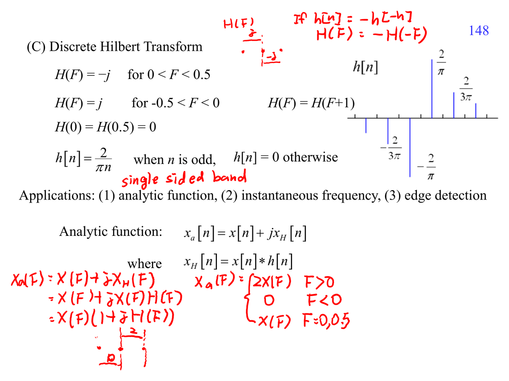

# Hilbert transform filter

Hilbert transform 讓正頻率 phase shift $-90^\circ$、負頻率 $+90^\circ$，可建立 analytic signal。它的 magnitude 理想上不變，重點在 phase。

連結：[[Frequency response]]、[[Probability for random signals]]。

## 講義截圖

