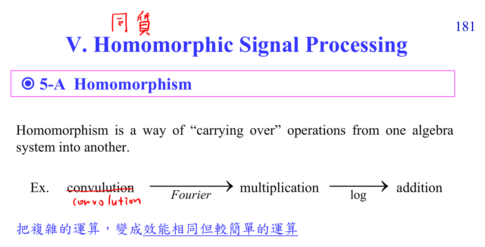

# Homomorphic signal processing

Homomorphic 的關鍵 pipeline 是 convolution -> Fourier -> multiplication -> log -> addition。進入 cepstrum domain 後，source 和 filter 如果落在不同 quefrency range，就能用 lifter 分離。

## 深入解說

Homomorphic processing 的精神是「換一個空間讓難運算變簡單」。講義的主線是 convolution 在 Fourier domain 變 multiplication，再經過 log 變 addition，於是原本混在一起的 source/filter/channel 有機會在 cepstrum domain 分開。這裡 notation 容易卡住：spectrum 是頻率軸，cepstrum 是 quefrency 軸；filtering 在 cepstrum 裡常被叫 liftering。你要特別注意 log 的 phase ambiguity、zero crossing、minimum phase 假設，因為這些不是小細節，而是決定 inverse cepstrum 能不能回到合理 signal 的條件。

## 對你目前程度的讀法

先把這篇放回 [[Cepstrum prerequisite map]]。如果公式看起來突然跳太快，先不要急著背結論；把每個 symbol 的 role 寫在旁邊：它是 sample index、frequency variable、filter coefficient、random variable，還是 matrix/vector component。ADSP 很多困難其實不是微積分技巧，而是 notation 在 time domain、frequency domain、Z-domain、matrix domain 之間切換。

## 公式和講義圖怎麼讀

核心 chain 是 $y[n]=x[n]*h[n] \Rightarrow Y(e^{j\omega})=X(e^{j\omega})H(e^{j\omega}) \Rightarrow \log Y=\log X+\log H$。取 inverse transform 後，addition 留在 cepstrum/quefrency domain。若講義提 inverse cepstrum，請特別檢查 phase 是否被保留。

## 常見卡點

- 把 DFT bin 當成連續頻率，會誤讀頻譜解析度與 aliasing。
- 只看 magnitude 不看 phase，會漏掉 delay、linear phase、minimum phase、cepstrum inverse 等問題。
- 把 optimal 當成絕對最好；其實 optimal 永遠相對於 chosen model、norm、constraint。
- 忘記 implementation cost；ADSP 後半的 fast algorithms 會一直追問同一個數學結果能不能更有效率地算。

## 自我檢查

能不能把 convolution 到 addition 的每一步寫出來？能不能分辨 spectrum frequency 和 cepstrum quefrency？能不能說明 inverse 時 phase 為什麼麻煩？

## 相關筆記

- [[Advanced digital signal processing]]
- [[ADSP math prerequisites MOC]]
- [[Cepstrum prerequisite map]]

## 講義截圖

