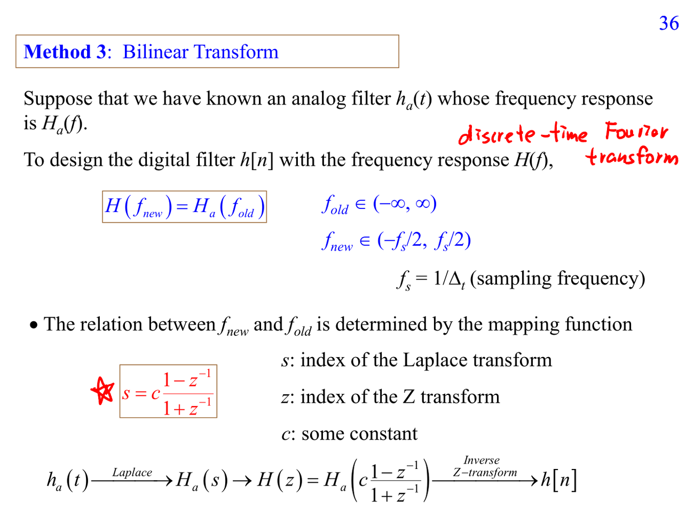

# IIR filter

IIR filter 用 feedback 產生無限長 impulse response，常能用較低 order 達成 sharp response。風險是 stability 取決於 poles 是否在 unit circle 內，phase 通常也較難控制。

連結：[[Optimization for filter design]]、[[Frequency response]]。

## 講義截圖

