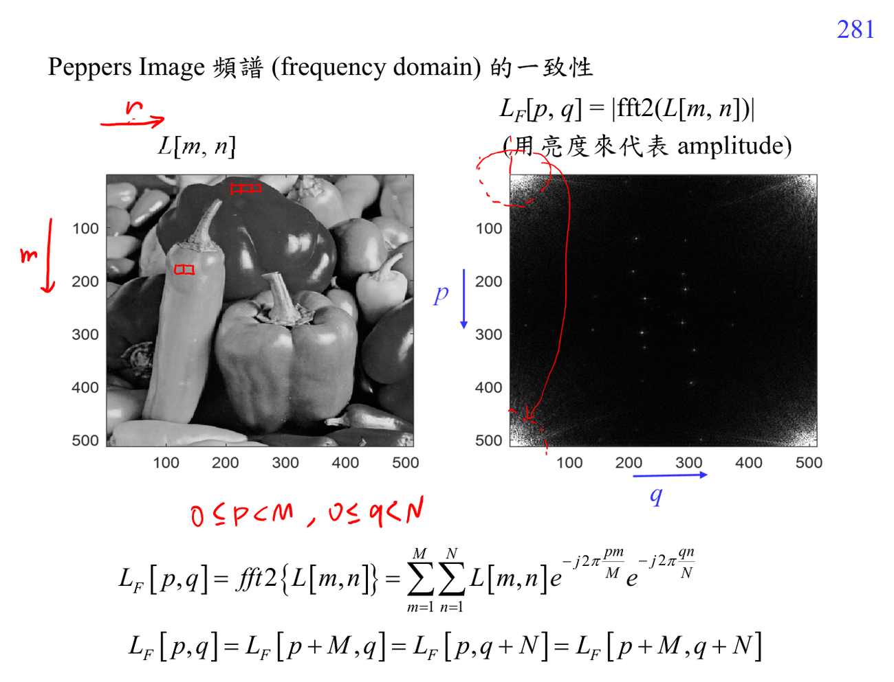

# Image compression

Image compression 會利用影像在 space domain 的鄰近像素相似，以及 frequency domain 的能量集中。平滑區域代表 low-frequency energy 大，edge/texture 代表 high-frequency energy。

JPEG 的策略是用 [[Discrete cosine transform]] 集中 energy，再丟掉人眼比較不敏感的高頻資訊。

## 講義截圖

