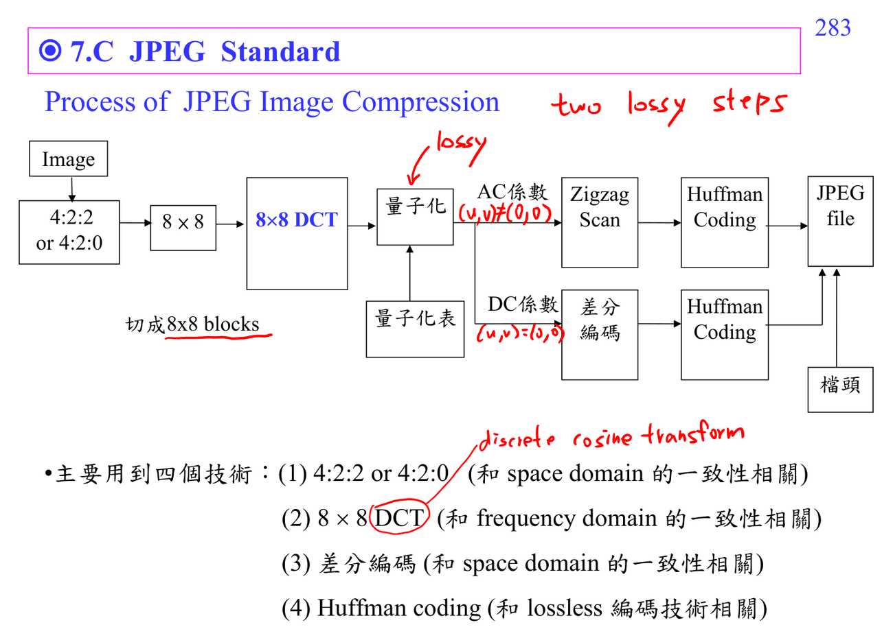

# JPEG compression

JPEG pipeline 要按順序讀：color transform -> [[Chroma subsampling|chroma subsampling]] -> 8x8 block [[Discrete cosine transform|DCT]] -> [[Quantization|quantization]] -> zigzag -> run-length/Huffman。最主要失真來自 quantization。

連結：[[Compression math prerequisites]]、JPEG compression。

## 講義截圖

