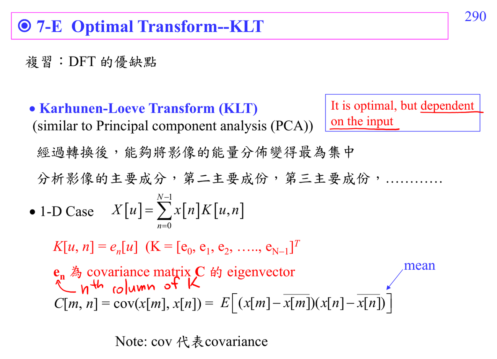

# Karhunen-Loeve transform

KLT 是對 random process/data covariance 最佳的 decorrelating transform；它理論上 optimal，但 transform basis depends on data，所以 [[JPEG compression|JPEG]] 會用固定 [[Discrete cosine transform|DCT]] 當近似。

連結：[[Matrix diagonalization for transforms]]、[[Linear algebra for DSP]]。

## 講義截圖

