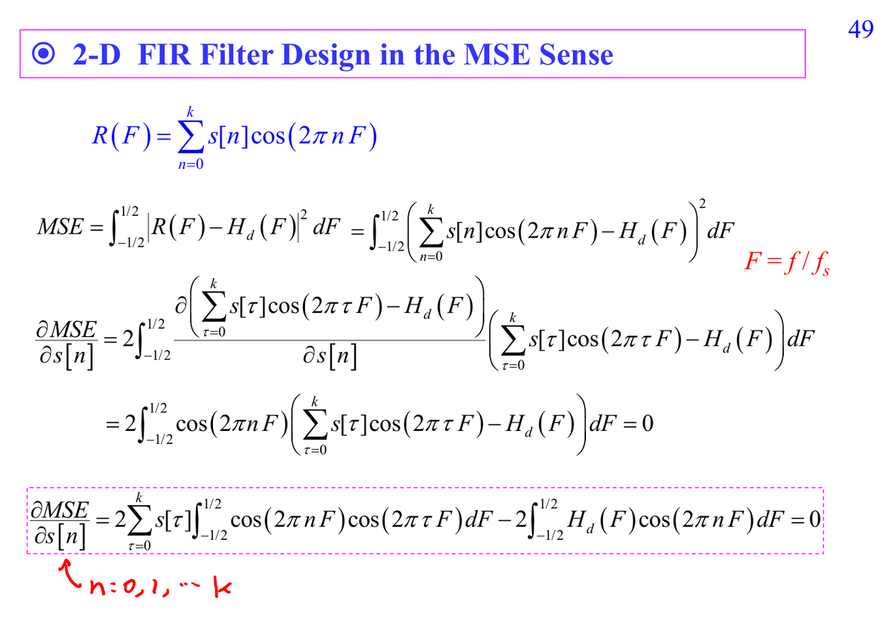

# Least MSE FIR design

Least MSE FIR design 用 $L_2$ norm 讓設計 response $R(F)$ 接近 desired response $H_d(F)$：

$$MSE=\int_{-1/2}^{1/2}|R(F)-H_d(F)|^2dF.$$

對係數 $s[n]$ 微分並令零，得到一組線性方程。若沒有 weight function 且使用 cosine basis，orthogonality 會讓結果很乾淨。

## 講義截圖

