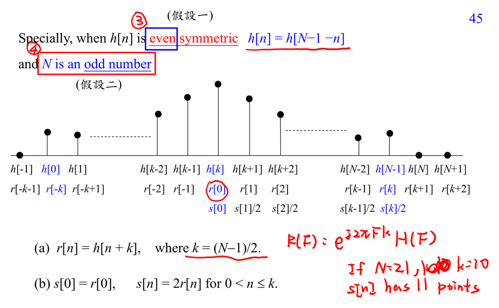

# Linear phase FIR filter

Linear phase 表示 phase 是 $-\omega d$ 加常數，所有頻率 delay 相同，waveform 不會被 phase distortion 扭曲。FIR 的對稱/反對稱係數是達成 linear phase 的關鍵。

連結：[[Optimization for filter design]]、[[Frequency response]]。

## 講義截圖

