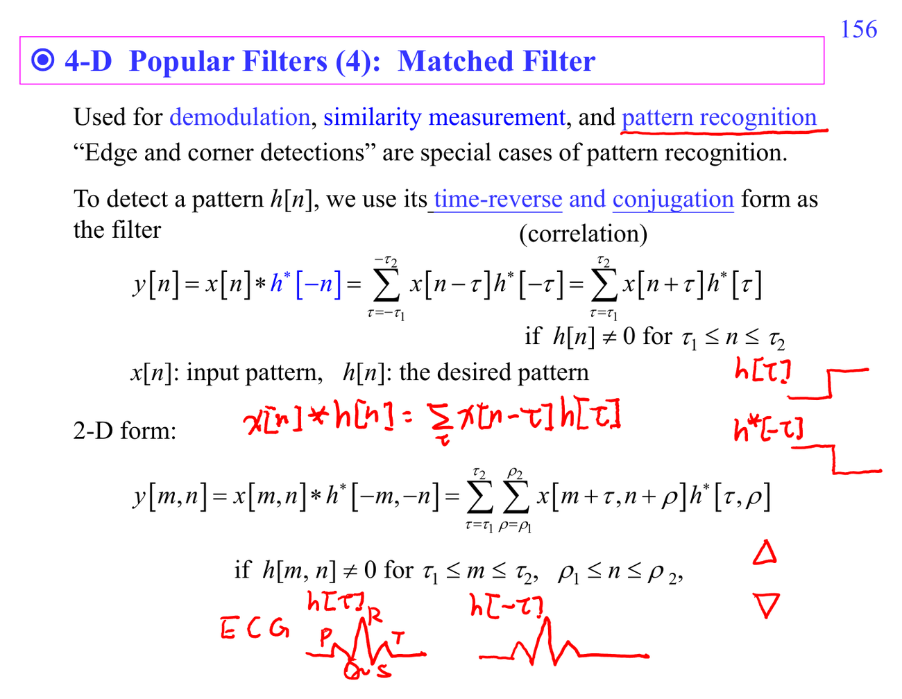

# Matched filter

Matched filter 對已知 template 的 time-reversed conjugate 做 convolution，使特定 signal 在 noise 中的 output SNR 最大。它是 detection problem，不只是濾波美化。

連結：[[Frequency response]]、[[Probability for random signals]]。

## 講義截圖

