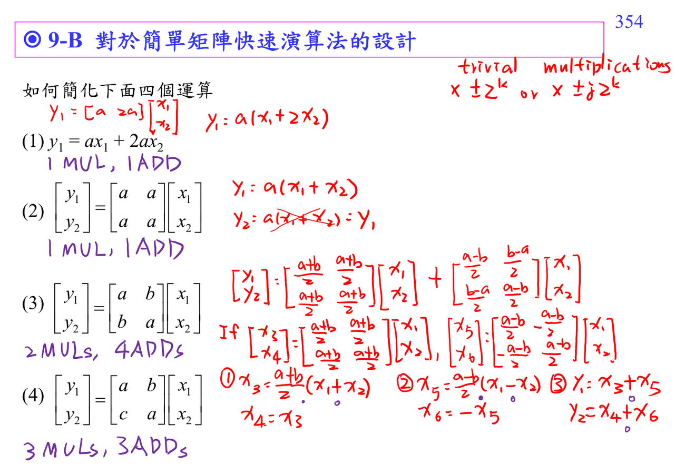

# Matrix multiplication complexity

一般 $M\times N$ matrix-vector multiplication 需要 $MN$ multiplications 與 $M(N-1)$ additions。Fast algorithms 通常利用 zero、repeated coefficients、symmetry、outer-product decomposition 來少算。

這是理解 [[Fast Fourier transform]] 和 [[Discrete cosine transform]] fast implementation 的基礎。

## 講義截圖

