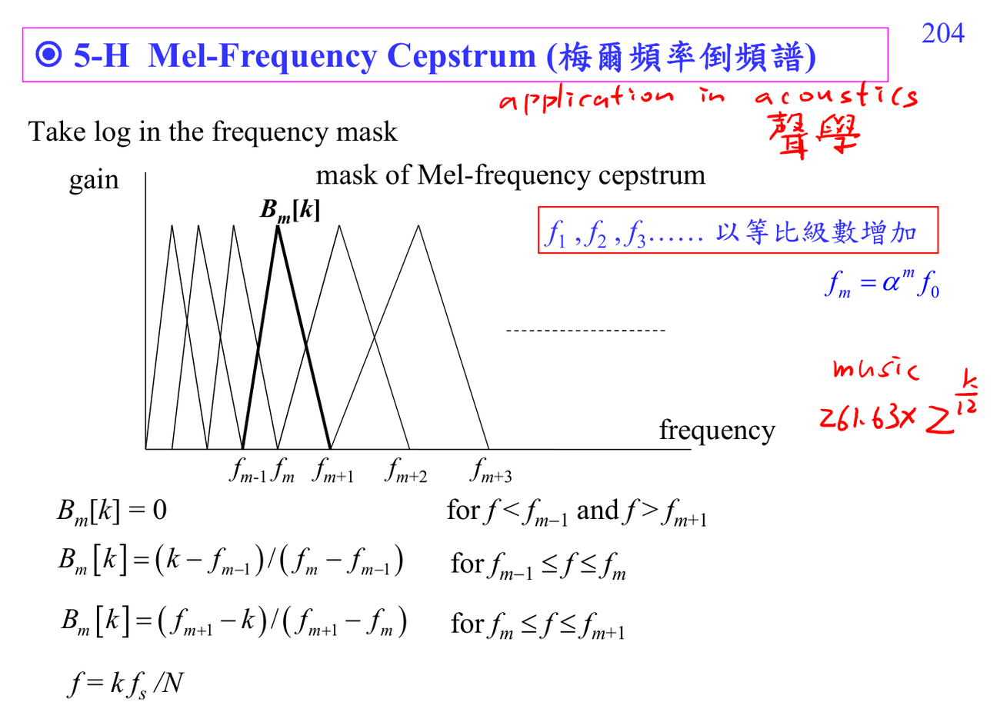

# Mel-frequency cepstrum

MFCC 先把 spectrum 經過 Mel-scale filterbank，再取 log 和 DCT。它不是為了完美重建，而是為了抽取符合人耳感知的 speech/audio features。

連結：[[Cepstrum prerequisite map]]、[[Homomorphic signal processing]]。

## 講義截圖

