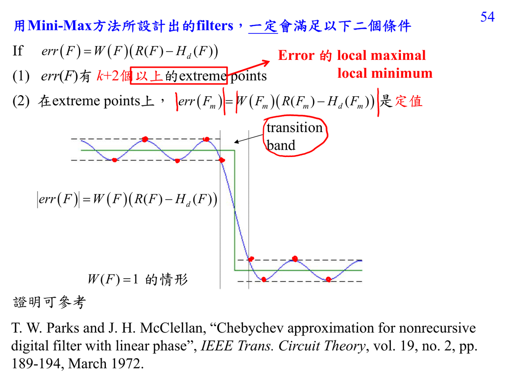

# Minimax FIR design

Minimax FIR design 用 $L_\infty$ norm 控制 maximal error：

$$\max_{F\notin\text{transition band}} |W(F)(R(F)-H_d(F))|.$$

它追求 equiripple：重要 extreme points 上的誤差大小相等、正負交替。這比 MSE 更重視 worst-case accuracy。

## 講義截圖

