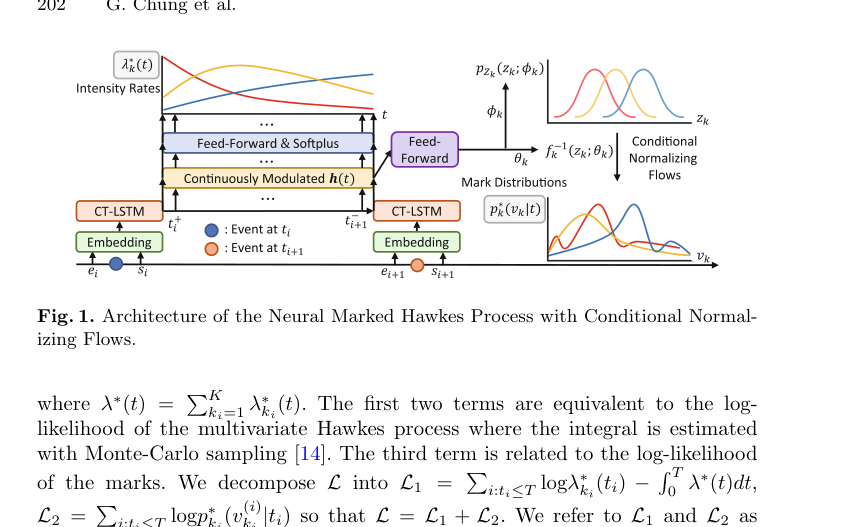

# Neural marked Hawkes process for LOB

這篇用 neural architecture 處理 [[Marked Hawkes process|marked Hawkes]] model 的限制。傳統模型通常需要指定 kernel shape 與 mark distribution；neural marked Hawkes 則讓 hidden state summarize history，再同時預測 next event timing/type 和 mark。

## Method In Words

可把模型拆成三塊：

1. history encoder：把 $\mathcal{H}_t$ 壓成 state $h_t$。
2. intensity head：由 $h_t$ 產生 $\lambda_i(t)$ 或下一事件分布。
3. mark head：建模 $p(v_{n+1}\mid k_{n+1},t_{n+1},\mathcal{H}_{t_{n+1}})$，連到 [[History dependent mark distribution]]。

因此它比 compound Hawkes 更 flexible，但 interpretability 較弱，且更依賴資料量與訓練穩定性。

這張圖放在 model architecture 小節。圖旁只需要簡明說明三個模組：encoder summarizes history；intensity head predicts event timing/type；mark head predicts order size distribution。

