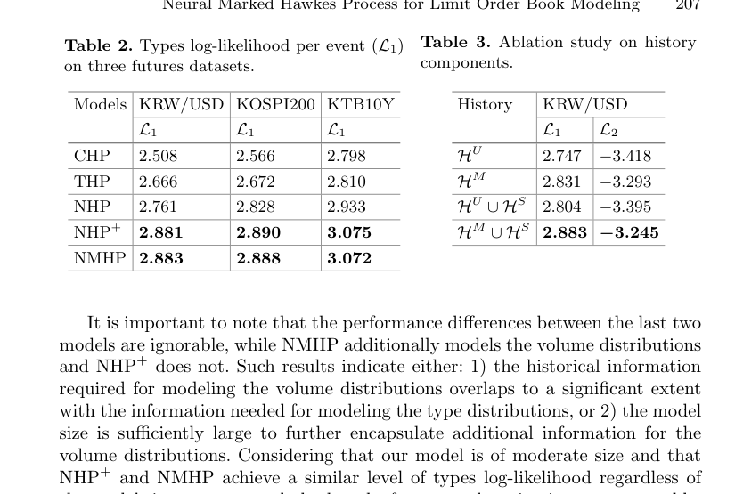

# Neural marked Hawkes process for LOB

這篇是 Hawkes/LOB 題目的 modern extension。它保留 temporal point process 的 event-stream view，但把 mark distribution 交給 neural history representation。

## Problem

LOB volume/order-size distributions are multimodal and history-dependent. Classical marked Hawkes models often use simple mark distributions or assume marks depend only weakly on history.

## Model Idea

令 history embedding 為 $h(t)$。模型把 event type intensity 與 mark density 分開：

$$
\lambda_k(t,v)=\lambda_k(t)\,p_k(v\mid h(t)).
$$

$p_k(v\mid h(t))$ 可由 Conditional Normalizing Flow 或 Mixture Density Network 表示，因此能處理 non-Gaussian, multimodal, history-dependent volume distributions。

## How To Use In The Report

這篇適合放在最後的 extension/discussion：它顯示 Hawkes process 可以從 interpretable kernels 走向 representation learning。但也要誠實說，neural model 的可解釋性低於 kernel matrix，且評估通常依賴 likelihood/ablation rather than direct economic interpretation。

## Comparison Point

相對於 [[Compound Hawkes process for LOB order size modeling]]，NMHP 更強調 conditional mark distribution；相對於 [[Bacry Muzy 2015 Hawkes second-order statistics]]，它更少強調 closed-form kernel interpretation。

## Figures For Report

