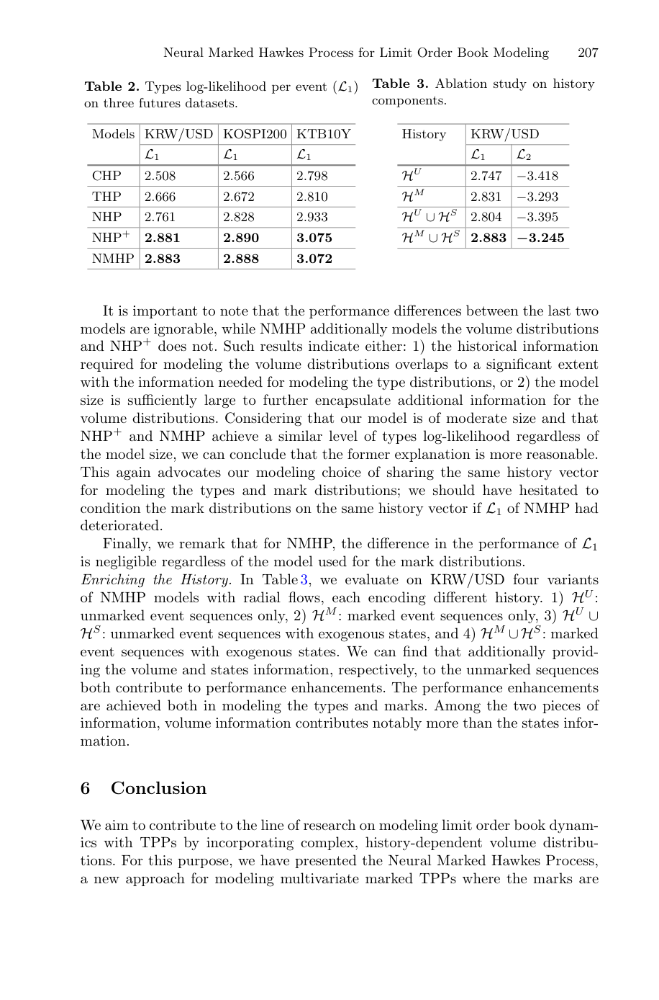

# Neural marked Hawkes process for LOB

這篇是 Hawkes 專題的 neural extension。它把 LOB event stream 視為 multivariate marked temporal point process，其中 event type 是 order type，mark 是 order volume。

核心貢獻：

- 用 Neural Hawkes Process architecture 建立 history vector。
- mark distribution 不再固定或只依賴 latest observation，而是 conditioned on history。
- 以 Conditional Normalizing Flows 或 Mixture Density Network 表示複雜 volume distributions。
- 同時評估 event type likelihood 和 mark likelihood，證明 history-dependent mark modeling 有幫助。

報告定位：

- 和 [[Bacry Muzy 2015 Hawkes second-order statistics]] 相比：這篇比較 flexible，但可解釋性較低。
- 和 [[Compound Hawkes process for LOB order size modeling]] 相比：compound Hawkes 更透明，NMHP 更能處理 multimodal/history-dependent volume。
- 可放在 Discussion 作為 modern extension。

## 論文圖表截圖

