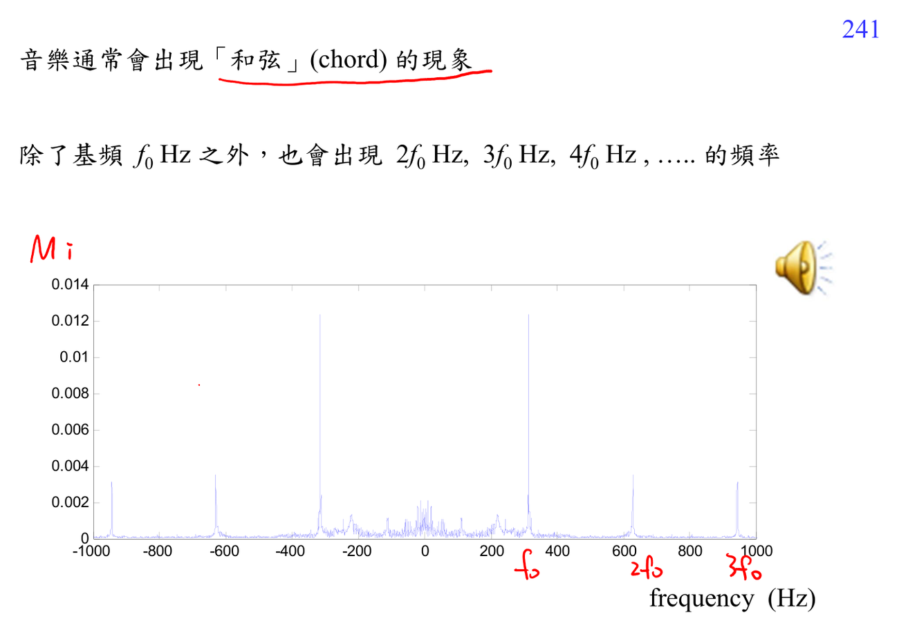

# Pitch and harmonics

Pitch 對應 fundamental frequency，harmonics 是其整數倍。頻譜上 harmonic spacing 可估 pitch，但短窗、noise、formants 會讓估計變難。

連結：[[Spectral analysis workflow]]、[[Cepstrum prerequisite map]]。

## 講義截圖

