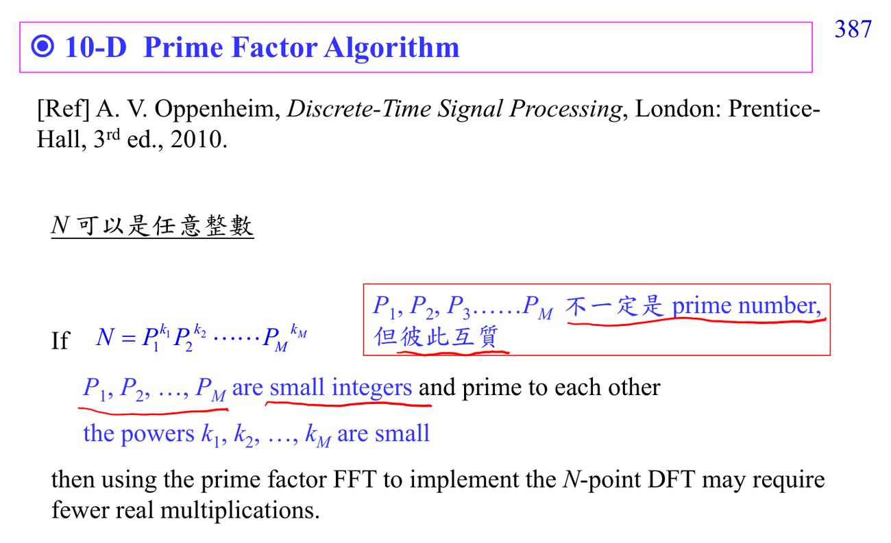

# Prime factor FFT

Prime factor FFT 用在 $N=N_1N_2$ 且 $N_1,N_2$ 互質的情況。因為兩個因子互質，可以用類似 Chinese remainder 的 index mapping，把 1-D index 重新對應成 2-D grid。

它和一般 Cooley-Tukey 的差別在於：在合適條件下，某些 twiddle factors 可以消失或被大幅簡化。這讓計算量下降，但也讓 index mapping 更難讀。

讀講義的 prime factor [[Fast Fourier transform|FFT]] 圖時，重點不是背 mapping 公式，而是確認：

- 長度是否真的能分成互質因子。
- input index 和 output index 如何重排。
- 哪些 multiplication 被省掉。

如果 index mapping 卡住，先回 [[Cooley-Tukey FFT]]，再讀 [[Fast algorithm prerequisite map]]。

## 講義截圖

