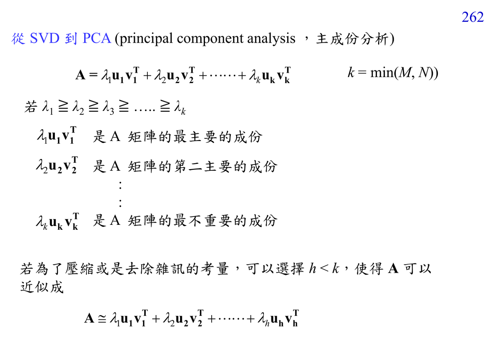

# Principal component analysis

PCA 找最大 variance 的方向，讓資料投影後保留最多能量。它可看成 covariance matrix 的 eigen-decomposition，也可由 SVD 實作。

連結：[[Matrix diagonalization for transforms]]、[[Linear algebra for DSP]]。

## 講義截圖

