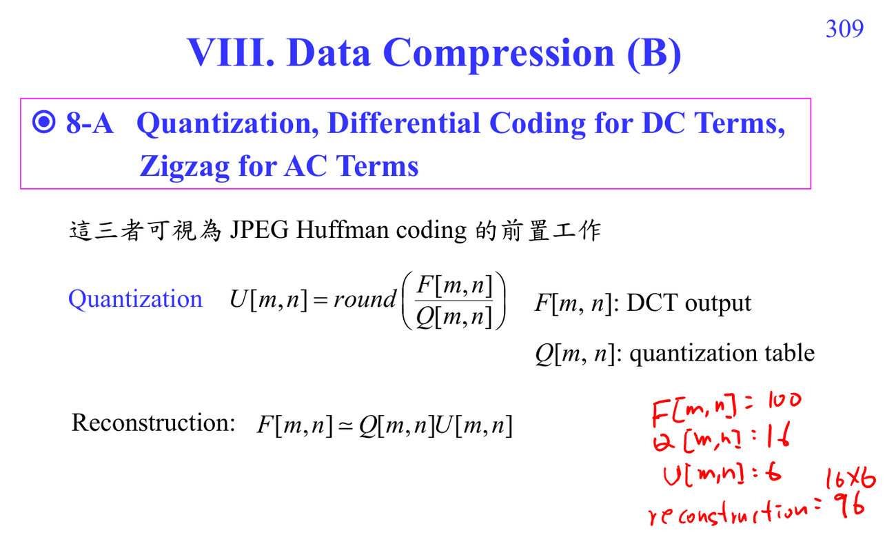

# Quantization

Quantization 把 transform coefficient 除以 quantization table 後 round：

$$U[m,n]=round\left(\frac{F[m,n]}{Q[m,n]}\right).$$

它是 JPEG 的主要 lossy step。高頻 coefficient 通常給較大的 $Q[m,n]$，因此更容易變成 0。

## 講義截圖

