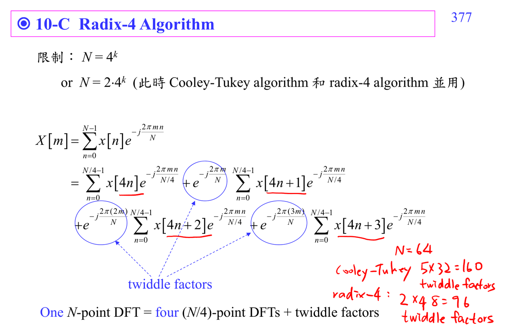

# Radix-4 FFT

Radix-4 FFT 是 Cooley-Tukey 的一種選擇：每次把長度拆成 4 個子問題。若 $N$ 是 $4^m$ 或含有大量 4 的因子，radix-4 通常比 radix-2 stage 更少。

它的優點不是「公式比較漂亮」，而是 stage 數變少，某些 twiddle multiplication 可合併或簡化。代價是 butterfly 比 2-point butterfly 複雜，index mapping 也比較容易看錯。

讀 radix-4 圖時，把每個 4-point block 看成 small DFT。先確認四個 input 如何組成 sum/difference，再看哪些分支乘上 $-j$ 或其他 twiddle factors。

相關連結：[[Cooley-Tukey FFT]]、[[Butterfly computation]]、[[Twiddle factor]]。

## 講義截圖

