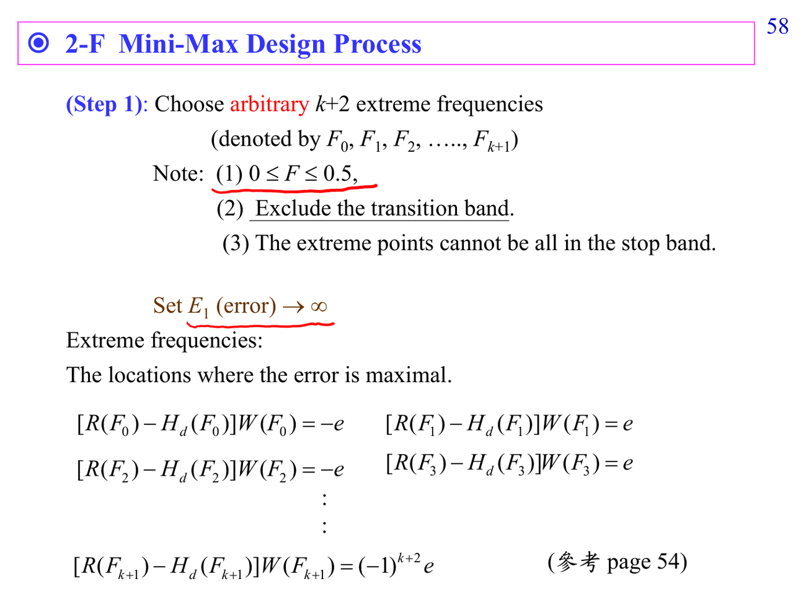

# Remez exchange algorithm

Remez 用 alternation theorem 反覆更新 extremal frequencies。你可以把它想成在找一組點，讓加權誤差正負交替且同高，逼近 minimax optimum。

連結：[[Optimization for filter design]]、[[Frequency response]]。

## 講義截圖

