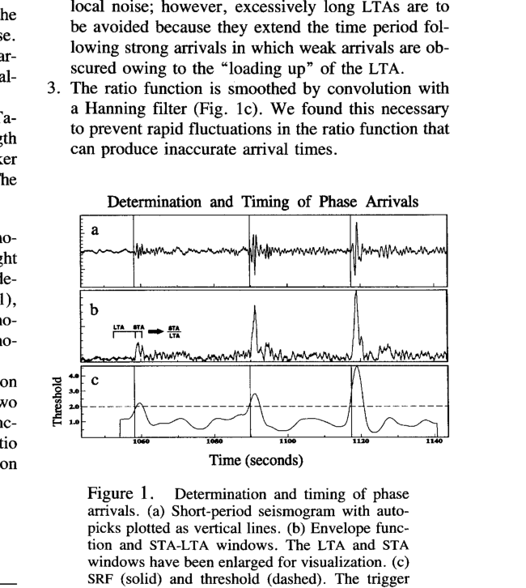
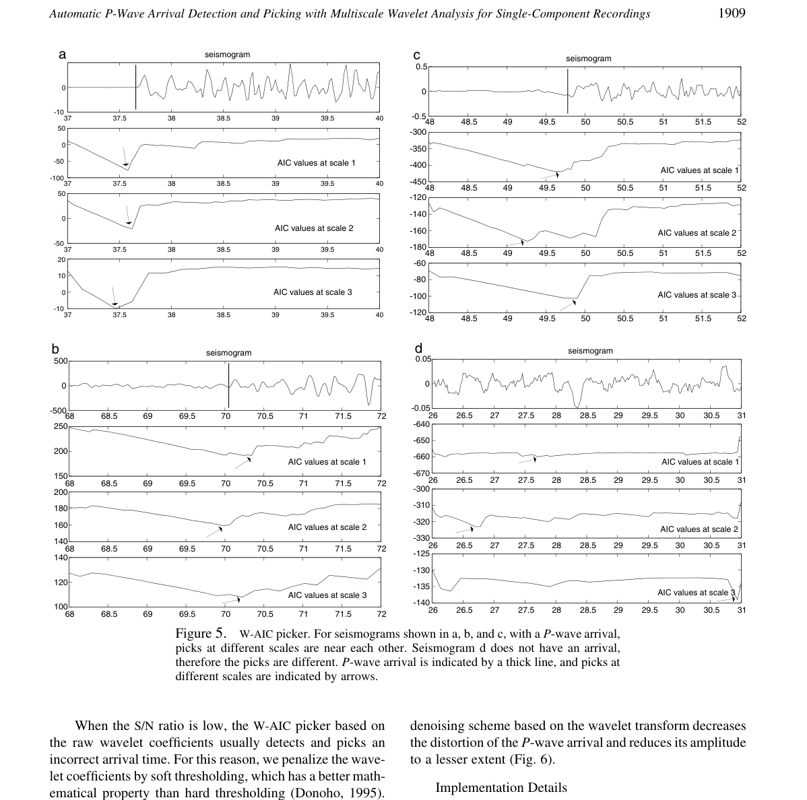
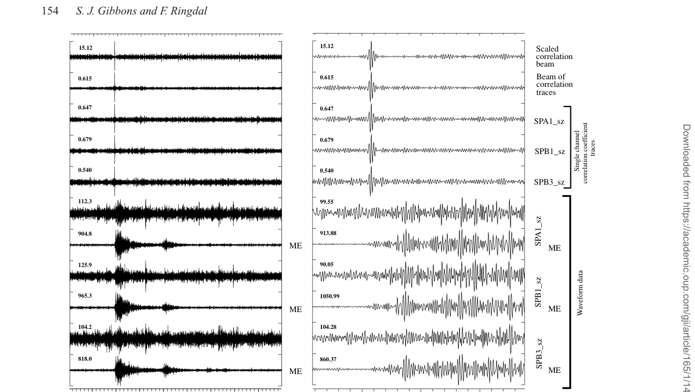

# Seismic wave signal processing project

這個題目適合寫成「方法比較 + 統一 signal model」的報告，而不是單純介紹三篇論文。主線可以是：

**How can an ADSP detector estimate seismic phase arrival time from noisy, nonstationary waveform data?**

核心論點：phase picking 的本質是把連續 waveform 轉成一個可靠的 [[Detector statistic]]，再從 statistic 的 peak、minimum 或 threshold crossing 推出 arrival time $\hat{\tau}$。STA/LTA、AIC、wavelet-AIC、waveform correlation 的差異，不是誰比較「高級」，而是它們假設 arrival 會以什麼形式留下 evidence。

## Report-Ready Argument

1. [[STA LTA picker]] 是 baseline：arrival 被視為 local energy 突增，所以 detector 是 short-term energy / long-term background energy。
2. [[AIC picker]] 把 arrival 視為 [[Change point detection]]：到達前後的 waveform statistics 不同，因此選讓 two-segment model 最合理的切點。
3. [[Wavelet transform for seismic picking]] 補足 AIC 對 window/noise 的敏感：真正的 P-wave onset 應該在多個 scale 上都留下可定位的變化。
4. [[Waveform correlation detector]] 與 [[Array beamforming for seismic detection]] 把問題從 onset picking 轉成 template matching：若弱事件與 template 來源接近，correlation peak 在多台站上會 coherent。

## Unified Notation

- $x[n]$：single-channel discrete seismogram。
- $x_m[n]$：array 中第 $m$ 個 sensor 的 waveform。
- $\tau$ / $\hat{\tau}$：true arrival time / estimated pick。
- $e[n]$：envelope 或 characteristic function。
- $D[n]$：detector statistic；pick rule 通常是 $\hat{\tau}=\arg\max_n D[n]$、$\arg\min_n D[n]$ 或 first threshold crossing。
- $s_m[n]$：template waveform，用於 correlation detector。

完整公式集中放在 [[Seismic project notation]]，報告正文只引用需要的式子。

## Figures To Keep

放在 baseline 小節：這張圖不是拿來替代公式，而是用來說明 STA/LTA 的 decision logic。raw waveform 先被轉成 envelope/characteristic function，ratio 超過 threshold 才形成 trigger；因此它清楚暴露此法的優點與弱點：快速，但 threshold 與 background estimate 很關鍵。

放在 wavelet-AIC 小節：這張圖的重點是 multiscale consistency。若同一個 arrival 在不同 scale 的 AIC minima 附近重複出現，pick 的可信度比單一 noisy trace 上的 local minimum 高。

放在 correlation/array 小節：這張圖支撐「coherence gives gain」這句話。單一 station 的 correlation peak 可能不夠穩，但多 station 對齊後 stack，弱事件的共同 peak 會被放大，random noise 則較難同步疊加。

## Reading Triage

這份 project note 是報告主線，不是逐段翻譯。被我壓掉或暫時不用的論文內容，集中記在 [[ADSP project paper triage notes#Seismic Wave Signal Processing Project]]。寫 final report 時若需要補實驗細節、資料設定、或 reviewer-style limitation，再從那篇 triage note 回去找。

## Suggested Sections

1. Abstract：一句話交代 seismic picking 是 ADSP detection problem，並比較 energy ratio、change-point、multiscale、correlation detector。
2. Introduction：說明 phase arrival 對 earthquake location、[[Travel time curve|travel-time]] analysis、event detection 的重要性。
3. Signal model and notation：使用 [[Seismic project notation]]。
4. Baseline detector: STA/LTA：主連結 [[Earle and Shearer 1994 automatic seismic phase picking]]。
5. Change-point and multiscale picking：主連結 [[Zhang Thurber Rowe 2003 wavelet AIC P-wave picking]]。
6. Template and array correlation：主連結 [[Gibbons Ringdal 2006 array waveform correlation]]。
7. Discussion：用 [[Seismic detector comparison]] 對比 assumptions, strengths, failure modes。
8. Conclusion：回到「detector statistic 是否穩定代表 physical arrival」。
