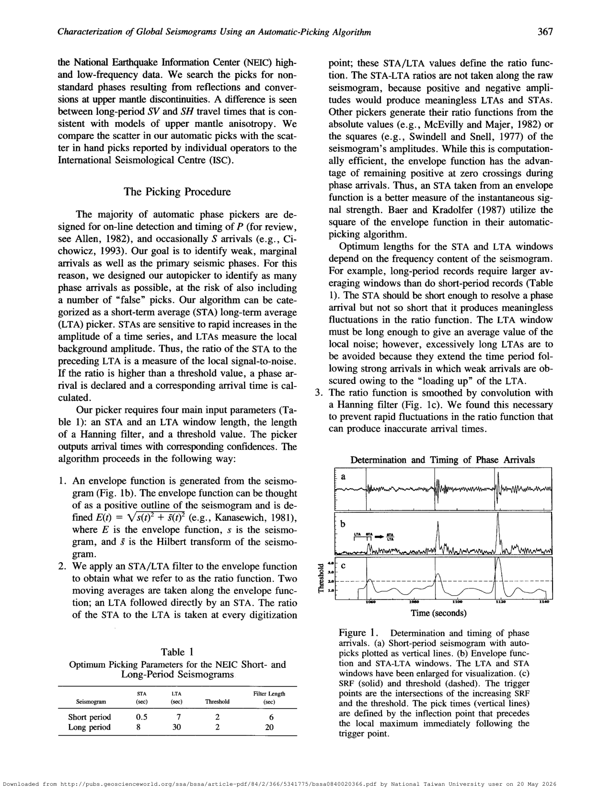
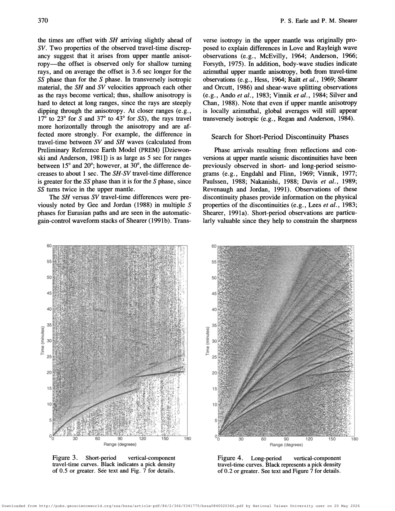
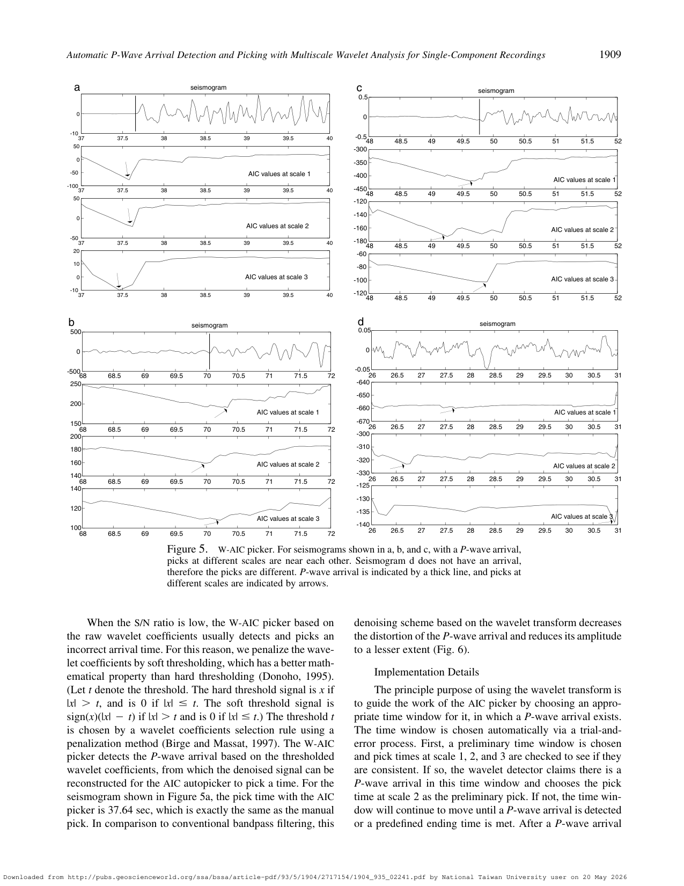
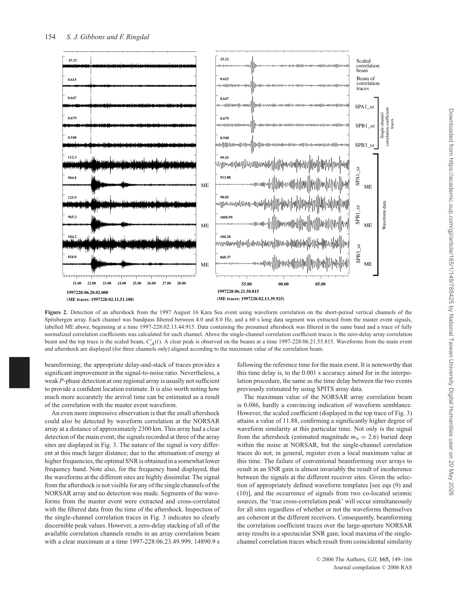

# Seismic wave signal processing project

這條專題可以寫成「Automatic seismic event detection and phase picking as an ADSP problem」。地震訊號是 noisy nonstationary waveform，目標是在大量連續資料中偵測事件並估計 P/S phase arrival time。

報告主線：

1. Problem formulation：輸入是 seismogram $x(t)$ 或 $x[n]$；輸出是 arrival time、phase label、pick quality。
2. Classical energy detector：[[STA LTA picker]] 用 short-term/long-term energy ratio 找 sudden onset，對應到 envelope、smoothing、thresholding。
3. Model selection picker：[[AIC picker]] 把 arrival 前後視為兩段不同 stationary process，用 AIC minimum 定位 change point。
4. Time-frequency/multiscale method：[[Wavelet transform for seismic picking]] 用不同 resolution 分離 P-wave singularity 和 noise/scattering。
5. Matched/correlation detector：[[Waveform correlation detector]] 利用 template waveform 找 repeating/co-located events；array case 再接 [[Array beamforming for seismic detection]]。
6. Evaluation：pick residual、SNR、false alarm、detection threshold、travel-time curve visibility。

核心論文筆記：[[Earle and Shearer 1994 automatic seismic phase picking]]、[[Zhang Thurber Rowe 2003 wavelet AIC P-wave picking]]、[[Gibbons Ringdal 2006 array waveform correlation]]。

可用圖：STA/LTA procedure、travel-time image、wavelet-AIC examples、array waveform correlation examples。這些圖可以放在 report 的 Method 或 Results discussion。

## 論文圖表截圖

