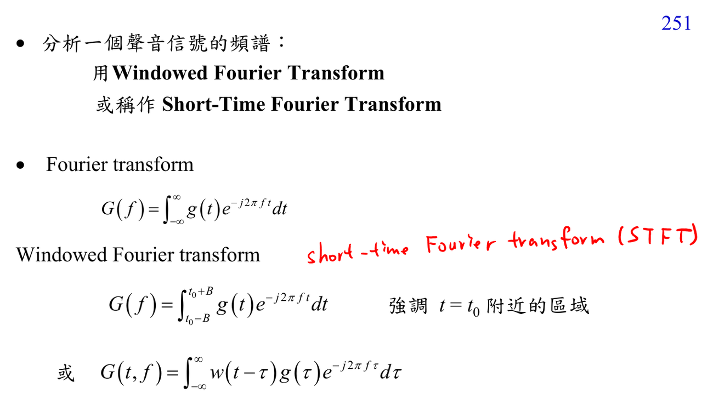

# Short-time Fourier transform

STFT 用 window 只看訊號在時間 $t_0$ 附近的 Fourier transform：

$$G(t,f)=\int w(t-\tau)g(\tau)e^{-j2\pi f\tau}\,d\tau.$$

它把 nonstationary speech 拆成 time-frequency representation。Window 短則時間解析度高、頻率解析度低；window 長則相反。

## 講義截圖

