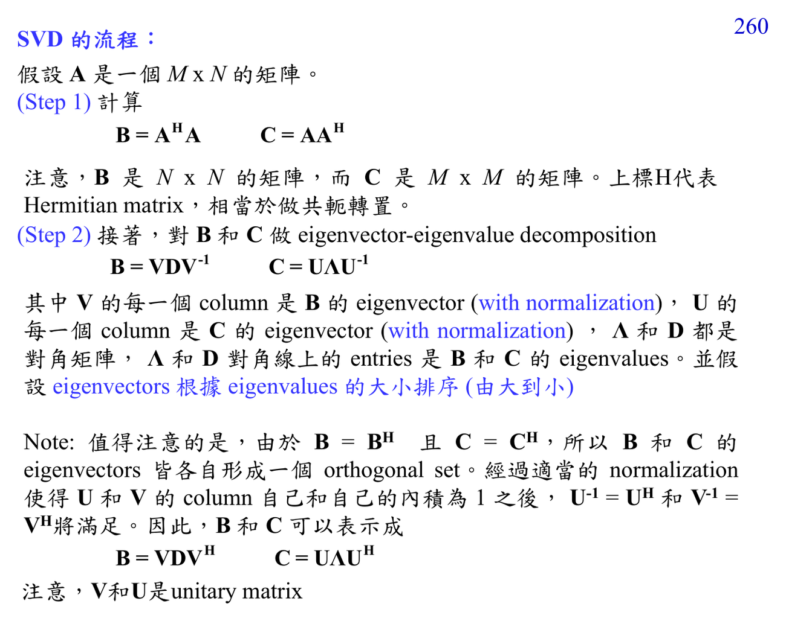

# Singular value decomposition

SVD 把任意矩陣拆成 $U\Sigma V^T$，可理解為 rotate -> scale -> rotate。它比 eigen-decomposition 更泛用，常用於 low-rank approximation、denoising、PCA。

## 深入解說

線代在 ADSP 裡不是抽象章節，而是把資料排成 vector/matrix 後的語言。內積描述 similarity，orthogonality 代表不互相干擾，covariance matrix 描述變數共同變動，eigenvectors 找出不會被線性轉換改變方向的 axes，SVD/PCA/KLT 則把 energy 集中到少數方向。讀這類圖時先找出矩陣的 rows/columns 代表什麼：samples、pixels、basis vectors、features，還是 transform coefficients。這會決定公式到底是在做 projection、decorrelation、compression，還是 denoising。

## 對你目前程度的讀法

先把這篇放回 [[Matrix diagonalization for transforms]]。如果公式看起來突然跳太快，先不要急著背結論；把每個 symbol 的 role 寫在旁邊：它是 sample index、frequency variable、filter coefficient、random variable，還是 matrix/vector component。ADSP 很多困難其實不是微積分技巧，而是 notation 在 time domain、frequency domain、Z-domain、matrix domain 之間切換。

## 公式和講義圖怎麼讀

Projection 可寫成 coefficient $c=\langle x,u\rangle$；若 basis orthonormal，energy 會乾淨分解。Covariance diagonalization 可寫成 $C=EDE^T$，KLT/PCA 用 $E^T x$ 當 transform。SVD 則是 $A=U\Sigma V^T$，singular values 由大到小代表可保留的主要 energy。

## 常見卡點

- 把 DFT bin 當成連續頻率，會誤讀頻譜解析度與 aliasing。
- 只看 magnitude 不看 phase，會漏掉 delay、linear phase、minimum phase、cepstrum inverse 等問題。
- 把 optimal 當成絕對最好；其實 optimal 永遠相對於 chosen model、norm、constraint。
- 忘記 implementation cost；ADSP 後半的 fast algorithms 會一直追問同一個數學結果能不能更有效率地算。

## 自我檢查

能不能說出 matrix 的 rows/columns 各代表什麼？能不能解釋 eigenvalue、singular value 或 variance 在該圖中的意義？

## 相關筆記

- [[Advanced digital signal processing]]
- [[ADSP math prerequisites MOC]]
- [[Matrix diagonalization for transforms]]

## 講義截圖

