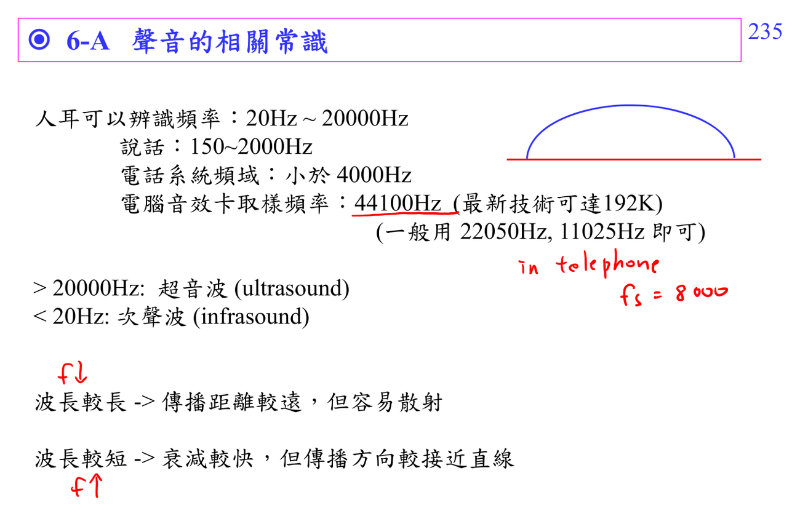

# Speech signal processing

Speech 可用 source-filter model：聲帶產生 excitation，vocal tract 作為 filter。STFT、formant、[[Cepstrum|cepstrum]] 都是在估計或分離這兩部分。

連結：[[Spectral analysis workflow]]、[[Cepstrum prerequisite map]]。

## 講義截圖

